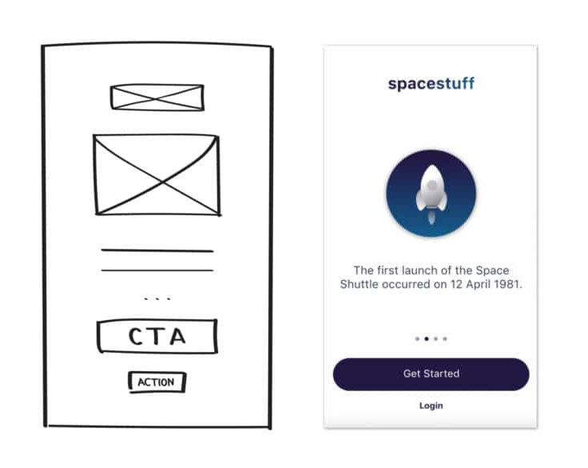

# Fases de maquetación de una página web

Hay muchas formas de afrontar la maquetación de una página web. Aquí proponemos una sencillita, con el objetivo de organizar mentalmente los pasos que se pueden dar durante todo el proceso. Cuando tengas experiencia maquetando lo harás a tu estilo y con los trucos que tú quieras, aquí solo proponemos una forma de trabajar.

Antes de empezar a escribir código os recomendamos que pintéis en una papel un esqueleto básico de las cajas o "divs" que identificamos en nuestra web. No hace falta fijarse en los detalles, céntrate en una visión esquemática del proyecto. Este proceso de esquematización en papel se llama "wireframing" y nos ayuda a visualizar la maquetación y las relaciones que establecerán los elementos entre sí.

Os mostramos un ejemplo:



Una vez que hemos realizado nuestro boceto en papel es hora de empezar a trabajar y escribir el código (HTML y CSS) de la página desde fuera (elementos más grandes) hacia dentro (elementos más pequeños). Debido a la herencia de CSS los estilos que damos a los elementos más grandes influyen en los de dentro.

A continuación detallamos cada uno de los pasos:

## Fases:

### 1: Añadir todos los contenidos

Empezamos añadiendo todos los contenidos de la página como: textos, listados, enlaces, imágenes... Dentro de sus respecttivas etiquetas semánticas, no te preocupes si más tarde tienes que retocar algo, volverás más adelante a repasar toda esta parte.

### 2: Crear el esqueleto (o scaffolding)

Basándonos en nuestro wireframe continuamos identificando aquellos elementos de la página web que componen un grupo, es decir, que actúan como una unidad. Sabemos que esos elementos (aunque sean muchos) se comportan como una unidad si:

* Se visualizan siempre juntos.
* Se visualizan en el mismo orden respecto a los elementos que les preceden y/o les siguen.
* Se visualizan en el mismo orden en todas las media queries.
* Se muestran y/u ocultan a la vez.
* Otras cosas dependiendo del diseño de la página.

### 3. Agrupar los elementos que forman un grupo o unidad

Tenemos que agrupar dentro de un contenedor (ya sea un `<div/>`, `<section />`, `<article />`... o cualquier otra etiqueta que nos sirva para agrupar) aquellos elementos que hemos identificado como un grupo o unidad.

Y debemos poner clases lo más descriptivas posibles a estos contenedores que hemos creado. 

### 4. Maquetar el esqueleto

Una vez que hemos creado el esqueleto de la página vamos a empezar a maquetarlo. 

Lo primero de todo antes de empezar a añadir estilos, tenemos que incluir normalize.css para que todos los navegadores interpreten los estilos de la misma manera. 

Después recuerda que cada etiqueta conlleva una serie de estilos por defecto (margins, paddings...) los cuales debemos resetear para que todo se vea correctamente.

Para ello creamos nuestro fichero CSS y añadimos el siguiente código:

```css
* {
  box-sizing: border-box;
}

body {
  margin: 0;
}

```
Una vez que hemos reseteado nuestras etiquetas es una buena idea añadir este código para visualizar las cajas principales y ver el espacio que ocupan y cómo se distribuyen.

```css
/* sustituir los siguientes selectores por las clases de tus contenedores y añadir los que falten */
.header-container,
.main-container,
.footer-container {
  border: solid 1px red;
}
```
Ahora ya podemos maquetar el esqueleto. Debemos crear los selectores que queramos y maquetar para distribuir estos contenedores o cajas para que se comporten como queremos.

Utilizaremos flexbox, grid, position... es decir, propiedades para distribuir y colocar los contenedores por la página.

El objetivo es ver que todos los contenedores se comportan como queremos. Si es necesario podemos darle un color de fondo diferente a cada contenedor.

Recuerdan que en este punto de la maquetación no estamos centrándonos en detalles, estamos encajando una primera maquetación de manera más general.

### 5. Maquetar los detalles

Una vez que tenemos encajada la maquetación general de nuestro proyecto, ahora sí, iremos encajando los detalles (botones, bordes, colores...). Recuerda, siempre desde lo más general a lo más específico.

## Durante todo el proceso de maquetación

Durante todo el proceso de maquetación tenemos que seguir las siguientes pautas:

* Recuerda que nuestra manera de afrontar una maquetación web es siempre siguiendo la técnica de "mobile first" por lo que, en todo momento, deberemos tener en mente que empezaremos a maquetar desde el tamaño más pequeño al más grande.
* Indentamos desde el primer momento. Indentar no es solo para que el código quede legible. También para que durante la programación veamos que no estamos cometiendo ningún error.
* Los textos de la página debemos escribirlos en el HTML de forma gramáticalmente correcta, como nos enseñaron en el colegio. Si en los diseños el título principal es "BIENVIENDA A ADALAB", en el código hay que poner "Bienvenida a Adalab". Y para ponerlo en mayúsculas utilizaremos propiedades de CSS.
* Los nombres de las clases tienen que describir lo que son, preferiblemente en inglés.
* Evitamos los nombres de clases con números. Por ejemplo, no nos gusta usar las clases `.title1` y `.title2`. Preferimos `.title` y `.subtitle`.
* Una etiqueta por renglón para ayudar a la legibilidad del código. Por ejemplo:

```html
<!-- esto no es legible -->
<ul class="list"><li class="link"><a href="http://adalab.es" class="link">Adalab</a></li></ul>

<!-- esto se lee muy fácilmente -->
<ul class="list">
  <li class="item">
    <a href="http://adalab.es" class="link">Adalab</a>
  </li>
</ul>
```
