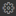

# Instalación de la terminal

## Instalación de la terminal (o consola)

Qué es la terminal o consola

### En Windows 10

## Windows 10 (mover a instalación de la terminal)

Si tienes Windows 10 vamos a instalar (un mini) Ubuntu dentro de tu Windows 10. Para ello:

1. Desde el menú inicio de tu Windows busca y abre **Microsoft Store**.
1. En el buscador del store busca **Ubuntu**.
1. Instala **Ubuntu 18.04 LTS**.
1. Verás que en tu menú inicio se habrá añadido un programa llamado **Ubuntu 18.04 LTS**.
1. Al instalar te pedirá que añadas una nueva contraseña. **Esta contraseña es la que utilizaremos siempre para la terminal.** No la pierdas!!

Una vez terminado debes:

1. Desde el menú inicio de tu Windows busca y abre **Activar o desactivar las características de Windows**.
1. Activa la opción **Subsistema de Windows para Linux**. Acepta y reinicia.

Después de haber hecho estas dos cosas tu Windows contará con una **terminal** que funciona igual que si estuvieras trabajando en Linux.

1. Instala VS Code ([aquí explicamos cómo](instalacion_de_vscode.md)).
1. Abre la configuración de VS Code pulsando en el icono de la tuerca (esquina inferior izquierda) y a continuación **Settings** .
1. Busca la opción **Terminal > External: Windows exec**.
1. Añade el texto **C:\windows\System32\cmd.exe**.
1. Abre una terminal puslando en el menú superior > **Terminal** > **New terminal**: una nueva terminal se abrirá en la parte inferior de VS Code.
1. En dicha parte inferior hay un desplegable, ábrelo y pulsa en **Select default shell**.
1. Selecciona la opción **WSL Bash**.

### En Ubuntu 18

### En Mac

## Usar la terminal dentro de VS Code

La terminal la podemos usar dentro o fuera de VS Code, pero es mejor dentro

## Instalar programas a través de la terminal

Explicar sudo

Mostrar el error que sale cuando no ponemos sudo