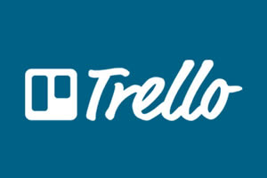

# Creación de cuenta de Trello

En Adalab también os vamos a enseñar a utilizar [Trello](https://trello.com/), que es un gestor de proyectos. Crea una cuenta usando **el mismo email de gmail con el que has confirmado tu plaza** en Adalab.

## Y ya estaría!!!

Aquí habríamos acabado de instalar todos los programas que utilizaremos durante el curso. Recuerda que si has tenido problemas durante la instalación, os ayudaremos después de la sesión de bienvenida de Adalab.