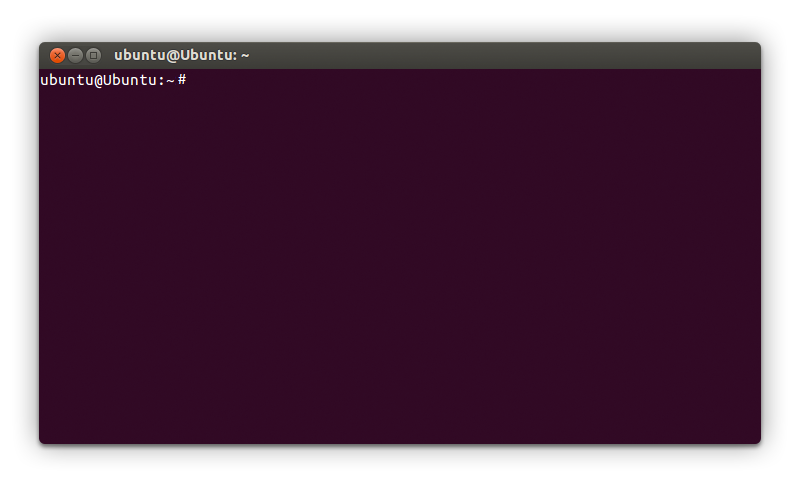
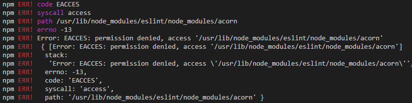

# Instalación de la terminal

## Qué es la terminal

La terminal, también conocida como consola o shell, es una de nuestras herramientas principales en el desarrollo. Nos permite comunicarnos con el sistema operativo mediante pequeñas instrucciones de texto, **llamamas comandos**, sin necesidad de una interfaz gráfica. Tiene esta pinta:



Hay diferentes tipos de terminales, nosotras utilizaremos la terminal **Bash**.

## Instalación de la terminal

### Instalación en Mac y Ubuntu

**Mac y Ubuntu ya vienen con una terminal bash instalada de serie.** Por ello no necesitamos instalar nada más. Si quieres abrir tu terminal busca en el menú el programa **Terminal**.

### Instalación en Windows 10

Windows tiene sus propias terminales como MS-DOS y Power Shell. Estas terminales **no** nos valen para programar así que vamos a instalar un mini Ubuntu dentro de Windows. Para ello:

1. Desde el menú inicio de tu Windows busca y abre **Microsoft Store**.
1. En el buscador del store busca **Ubuntu**.
1. Instala **Ubuntu 18.04 LTS**.
1. Verás que en tu menú inicio se habrá añadido un programa llamado **Ubuntu 18.04 LTS**, ábrelo.
1. Te pedirá que añadas una nueva contraseña. **Esta contraseña es la que utilizaremos para instalar programas en la terminal.** No la pierdas!

Una vez terminado debes:

1. Desde el menú inicio de tu Windows busca y abre **Activar o desactivar las características de Windows**.
1. Activa la opción **Subsistema de Windows para Linux**. Acepta y reinicia.

Después de haber hecho estas dos cosas tu Windows contará con una **terminal** que funciona igual que si estuvieras trabajando en Linux.

A continuación vamos a configurar VS Code para que siempre trabaje con esta terminal:

1. Abre la configuración de VS Code pulsando en el icono de la tuerca (esquina inferior izquierda)  y a continuación **Settings**.
1. Busca la opción **Terminal > External: Windows exec**.
1. Añade el texto **C:\windows\System32\cmd.exe**.
1. Abre una terminal puslando en el menú superior > **Terminal** > **New terminal**: una nueva terminal se abrirá en la parte inferior de VS Code.
1. En dicha parte inferior hay un desplegable, ábrelo y pulsa en **Select default shell**.
1. Selecciona la opción **WSL Bash**.

## Usar la terminal dentro de VS Code

En Mac, Windows y Ubuntu tenemos dos formas de utilizar la terminal:

- Buscándola en el menú del sistema operativo y abriéndola o
- Desde dentro de VS Code.

Preferimos hacerlo desde dentro de VS Code porque es más cómodo. Por ejemplo las opciones de copiar y pegar funcionan mejor, la terminal siempre se abre en la misma carpeta en la que hemos abierto el VS Code...

Por ello cada vez que tengamos que usar la terminal tendremos que:

1. Abrir VS Code.
1. Pulsar en el **menú superior > Terminal**.
1. Pulsar en **Nueva terminal**.

## Instalar programas a través de la terminal

De vez en cuando vamos a instalar programas a través la terminal. Para ello tendremos que escribir comandos en la terminal como:

```bash
apt install nodejs
```

Es probable que al instalar programas la consola muestre un error diciendo que no tenemos permisos para instalarlo porque se requiere ser administrador para poder hacerlo. En los errores suele poner algo como EACCES (error de acceso):



Cuando nos pase esto y sepamos que el error es porque se necesitan permisos de administración para instalar el programa, **usaremos el comando mágico `sudo`**.

### Instalar con sudo

El comando `sudo` nos permite instalar programas con permisos de administrador. Para ello escribiremos el comando `sudo` delante del comando que queramos ejecutar, por ejemplo:

```bash
sudo apt install nodejs
```

A continuación la terminal nos pedirá la contraseña del administrador.

La contraseña en Mac y Ubuntu **es la de nuestro usuario**, la que escribimos al iniciar sesión cuando arrancamos el ordenador.

La contraseña en Windows **es la que hemos escrito cuando hemos instalado el mini ubuntu** al principio de esta página.

> **IMPORTANTE:** acuérdate del comando mágico `sudo` lo utilizarás a menudo en tu vída como programadora.