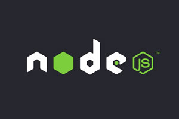

# Instalación de Node JS

## Qué es Node JS



Node JS es un lenguaje programación que nos sirve para ejecutar JavaScript en la terminal de un ordenador. En Adalab y en muchas empresas lo utilizamos también para automatizar tareas y facilitarnos la vida mientras programamos. Vamos a instalarlo:

### Instalación en Windows 10 y Ubuntu

Abre una terminal en VS Code y sigue escribe los siguientes comandos de uno en uno:

```bash
sudo apt install curl
```

```bash
curl -sL https://deb.nodesource.com/setup_12.x | sudo -E bash -
```

```bash
sudo apt install nodejs
```

### Instalación en Mac

Abre una terminal y ejecuta la siguiente línea:

```bash
sudo brew install node@12
```

### Comprobando si lo hemos instalado bien

Una vez terminada la instalación de Node JS desde cualquiera de los 3 sistemas operativos debemos comprobar que todo ha ido bien. Para ello ejecutaremos en la terminal la siguiente línea:

```bash
node --version
```

Y la terminal debe mostrar la versión de Node JS instalada, algo como `v12.16.3`. **Es importante que empiece por v12.** Si por el contrario la terminal muestra el mensaje `No se ha encontrado la orden «node»...` es que algo hemos hecho mal. Vuelve a repetir todos los pasos y si no te funciona consulta a tu profesor.
