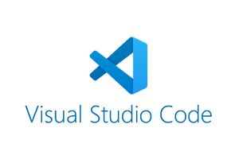

# Instalación de VS Code

## Qué es VS Code

Visual Studio Code (también conocido como VS Code o Code a secas) es el editor de código con el que vamos desarrollar nuestras páginas webs. Además dispone de un montón de extensiones y plugins que nos facilitan mucho la vida.

### Instalación en Windows 10 y Mac

Para Windows 10 y Mac [descarga e instala VS Code desde aquí](https://code.visualstudio.com/Download).

### Instalación en Ubuntu 18

Desde Ubuntu, la forma más cómoda es acceder al instalador de aplicaciones desde el menú, y ahí buscar **VS Code** e instalarlo.

## Plugins de VS Code

Los plugins son extensiones para ampliar y personalizar el funcionamiento de VS Code. Hay muchísimos. Nosotras vamos a utilizar las siguientes durante el curso. Accede a ellas e instálas:

- [Live server:](https://marketplace.visualstudio.com/items?itemName=ritwickdey.LiveServer) para tener un servidor local en nuestro ordenador.
- [Live share:](https://marketplace.visualstudio.com/items?itemName=MS-vsliveshare.vsliveshare) para compartir nuestro código con nuestras compañeras.
- [Prettier:](https://marketplace.visualstudio.com/items?itemName=esbenp.prettier-vscode) para formatear nuestro código y que sea fácil de leer.
- [Git Graph:](https://marketplace.visualstudio.com/items?itemName=mhutchie.git-graph) para trabajar con Git.
- [ES lint:](https://marketplace.visualstudio.com/items?itemName=dbaeumer.vscode-eslint) para validar nuestro código y que tenga más calidad.
