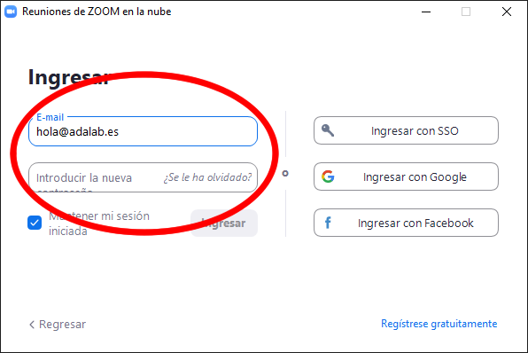

# Instalación de Zoom

En Adalab utilizamos varias herramientas para comunicarnos cuando no estamos en clase. Una de ellas es la plataforma de video streaming Zoom, así que vamos instalarlo en nuestro ordenador y crearnos una cuenta.

## Instalación

A continuación debes instalar Zoom en tu ordenador:

### Instalación en Windows

- Descarga e instala [Zoom](https://zoom.us/support/download).

### Instalación en Mac

- Descarga e instala [Zoom](https://zoom.us/support/download).

### Instalación en Ubuntu

- Accede al instalador de aplicaciones desde el menú.
- Buscar **Zoom** e instálalo.

## Crea una cuenta en Zoom

- Entra en [Zoom.us](https://zoom.us/).
- Crea una cuenta **con el mismo email que nos has proporcionado** a Adalab.
- Abre la aplicación de Zoom de tu ordenador.
- Ingresa desde el formulario de la izquierda. Esto es importante, si accedes desde el botón de la derecha **Ingresar con Google** hay cosas que no funcionan correctamente.

## Consejos

- Descarga la aplicación. La versión web tiene memos funcionalidades que la aplicación.
- Usa auriculares, al ser posible con micrófono, para reducir el eco.
- Usa la webcam. Al vernos las caras la comunicación fluye mucho mejor.