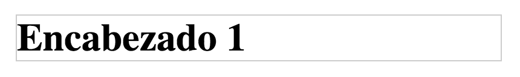
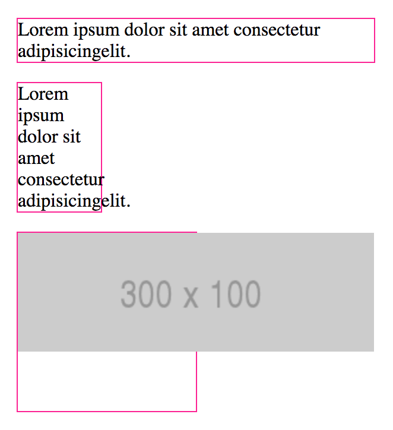
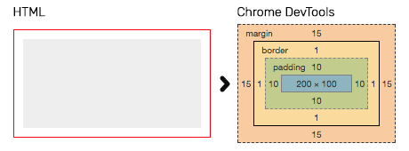

# Modelo de caja, variables CSS y herramientas

## Contenidos

<!-- TOC depthFrom:4 depthTo:4 -->

- [EJERCICIO 1](#ejercicio-1)
- [EJERCICIO 2](#ejercicio-2)
- [EJERCICIO 3](#ejercicio-3)
- [EJERCICIO 4](#ejercicio-4)
- [EJERCICIO 5](#ejercicio-5)
- [EJERCICIO 6](#ejercicio-6)
- [EJERCICIO 7](#ejercicio-7)
- [EJERCICIO 8](#ejercicio-8)
- [EJERCICIO 9](#ejercicio-9)

<!-- /TOC -->

## Introducción

En esta sesión veremos dos recursos fundamentales para construir nuestra web: el modelo de caja y las herramientas de desarrollo del navegador (DevTools).

Además vamos a descubrir la magia de las variables CSS o Custom Properties, algo realmente nuevo pero super útil que hará que el trabajo en proyectos muy grandes sea infinitamente más fácil de mantener sin depender de preprocesadores CSS como SASS (tranquila ya te le presentaremos más adelante ;))

Uno de los objetivos de la sesión es saber que hay dos modelos de caja y que las etiquetas HTML se comportarán de manera distinta en la estructura de tu documento dependiendo de ese modelo.

El navegador Google Chrome nos ofrece una serie de herramientas llamadas Chrome Dev Tools que nos permiten obtener información sobre la página actual que tenemos y realizar pruebas y modificaciones sobre ella. Estas herramientas son las siguientes:

- **El inspector de elementos:** nos permite ver el código de la página y los estilos que tiene aplicados a la vez que nos ofrece la posibilidad de modificarlo y cambiar los elementos de la web actual para hacer el proceso de maquetación más sencillo.
- **La herramienta Network:** muestra cuáles son los recursos o ficheros que carga la web actual, su peso y el tiempo que necesita para cargarlos. Además nos mostrará errores en caso de que algún recurso no pueda ser cargado debido a un error.

Las variables nos permitirán almacenar propiedades con un nombre y reutilizarlas a lo largo de nuestra hoja de estilos para que si, en un futuro, por ejemplo queremos cambiar un color, cambiemos solamente el valor de la variable y no el color uno por uno, en todas nuestras propiedades.

## ¿Para qué sirve lo que vamos a ver en esta sesión?

1. Para comprender **cómo se comportan las etiquetas** cuando les cambiamos propiedades de apariencia como margen, borde, padding y ancho/alto. Y qué pasa cuando el contenido no cabe en nuestro contenedor.
1. Para entender cómo se aplican **las imágenes de fondo**.
1. Para entender cómo se aplican los ajustes que realicemos a través de las DevTools.
1. Para reutilizar valores de las propiedades CSS.

## ¿En qué casos se utiliza?

- Cuando tengamos que darle un aspecto determinado al contenido, es decir, siempre :)
- Cuando tengamos un problema en nuestra página para detectar dónde está el error.
- Cuando tengamos un proyecto mediano o grande que requiera de un mantenimiento CSS.

## Modelo de caja

En HTML cada etiqueta se representa visualmente como una caja, lo podemos ver fácilmente añadiendo un borde a un elemento HTML y viendo cómo lo pinta el navegador, por ejemplo:

```html
<h1>Encabezado 1</h1>
```



El modelo de caja es una especificación que define el comportamiento de una etiqueta o elemento HTML y como interfiere en el resto de elementos de la página; es el que le dice al navegador cómo debe pintar cada elemento.

Antes de entrar en profundidad con los modelos de caja tenemos que ver conceptos básicos (alto, ancho, borde, margen y padding) y las formas básicas de visualización de los elementos HTML (display).

### Height, width, border, padding y margin

Todos los elementos HTML tienen una **altura** (height) y **anchura** (width). Además, puede tener otros atributos relacionados que influyen en su tamaño y su posición, que son el padding, los márgenes y los bordes:
- el **borde** de un elemento es una línea que puede tener distinto grosor y que encuadra el contenido del elemento.
- el **padding** es la distancia desde el contenido del elemento hasta el borde (podría pensarse como un margen interior).
- el **margen** es la distancia desde borde del elemento hasta los elementos que están a su alrededor (el margen exterior).

## Visualización (display)

La propiedad CSS `display`, se encarga de definir cómo se va a visualizar un elemento HTML, cómo va a colocarse en la página y cómo se colocarán el resto de elementos respecto a este. Según el valor que tenga asignado display, un elemento puede ocupar el ancho entero de su contenedor, ocupar solo el espacio que necesite para mostrar su contenido, mostrarse como si fuese una casilla de una tabla o directamente ocultarse.

Todas las etiquetas HTML tienen un valor `display` por defecto, pero por supuesto, nosotras podemos alterarlo para ajustarlo a nuestra maquetación.

Hay muchos valores distintos para `display` pero, por el momento, nosotros solo veremos estos cuatro:

- **block** (ocuparán el ancho completo del contenedor y se colocarán unas debajo de otras).
- **inline** (ocuparán el ancho de su contenido, por lo que se pueden alinear unas al lado de otras).
- **inline-block** (es un híbrido de las dos anteriores).
- **none** (oculta el elemento, no lo muestra).

### Block

Los elementos **en bloque** se muestran ocupando el ancho completo de su contenedor. En otras palabras, si tenemos un elemento en bloque dentro de una etiqueta `<aside>`, este ocupará el ancho completo del `<aside>`, si por lo contrario el elemento está directamente dentro del `<body>`, este ocupará el ancho del `<body>` y así siempre. Los elementos en bloque siempre empiezan en una nueva línea y nunca van a tener más elementos a su misma altura dentro del mismo contenedor, estarán más arriba o más abajo.

Como hemos comentado antes, los navegadores asignan automáticamente un modo de visualización por defecto a todos los elementos HTML. Algunos elementos como los párrafos `<p>`, los `<div>` o las listas (`<ol>` y `ul>`) por defecto se muestran en bloque debido a esos estilos que aplica el navegador.

[&rtrif; Elementos en bloque en Codepen](https://codepen.io/adalab/pen/WXQgrq)

Este Codepen representa cómo funcionan los elementos en bloque. En el resultado se ha puesto un fondo azul para que se vea el ancho total de cada elemento. Como se puede ver, en el caso del enlace, este ocupa el ancho de su contenido (del texto) mientras que los párrafos ocupan el ancho total del contenedor. El texto de los párrafos cabría perfectamente uno al lado del otro pero al ser bloques y ocupar ambos todo el ancho del contenedor, se muestran cada uno en una línea.

Usando CSS podemos hacer que un elemento que no se muestra en bloque cambie y se muestre de esta manera. Para ello aplicaremos `display: block` en el elemento. De esta forma, si queremos hacer que un elemento con la clase `block` se muestre en bloque, utilizaremos el siguiente código:

```css
.block {
  display: block;
}
```

A continuación se muestra la lista completa de elementos HTML que, por defecto, los navegadores web muestran en bloque:

`<address>`, `<article>`, `<aside>`, `<blockquote>`, `<canvas>`, `<dd>`, `<div>`, `<dl>`, `<dt>`, `<fieldset>`, `<figcaption>`, `<figure>`, `<footer>`, `<form>`, `<h1>-<h6>`, `<header>`, `<hr>`, `<li>`, `<main>`, `<nav>`, `<noscript>`, `<ol>`, `<output>`, `<p>`, `<pre>`, `<section>`, `<table>`, `<tfoot>`, `<ul>` y `<video>`.

> **Nota:** como es difícil memorizar la lista completa de elementos que se muestran en bloque, podemos hacernos la siguiente pregunta para saber si un elemento se mostrará en bloque o no: **"¿Tendría sentido meter este elemento dentro de un párrafo?"**. Si la respuesta es **no, es muy probable que el elemento sea un bloque**; si por lo contrario, la respuesta es **sí, probablemente sea un elemento en línea**. Por ejemplo, no tendría sentido meter una lista, un `<aside>` o un `<div>` dentro de un párrafo y por eso los navegadores muestran estos como bloques.

### Inline

Los elementos en línea o **inline** son aquellos que ocupan lo que ocupa su contenido, ocupan solo el espacio que necesitan. En estos, el tamaño será exactamente el tamaño de su contenido. Por ejemplo, si tenemos un enlace con el texto "púlsame", el ancho de ese enlace será el mismo ancho que el texto.

Debido a que los elementos en línea solo ocupan el ancho de su contenido, estos pueden colocarse uno al lado del otro hasta que no quede más espacio restante en la fila, en cuyo caso se colocarán en la fila siguiente. Cuando un elemento es muy largo y no cabe completamente en una línea, la parte que no cabe se baja a la línea siguiente. Por poner un ejemplo claro, un elemento en línea se comportaría como una letra más dentro de un texto, de hecho, estos también respetan los espacios entre ellos como se puede comprobar en el siguiente ejemplo.

[&rtrif; Elementos en línea en Codepen](https://codepen.io/adalab/pen/vWNzLj)

Como norma general, los elementos `inline` no deberían contener elementos de bloque.

Una regla muy importante que se aplica sobre los elementos en línea es que estos no pueden cambiar su ancho ni su alto, no pueden tener márgenes verticales y se puede aplicar margen y padding horizontal pero este no se tiene en cuenta a la hora de definir su altura y su posición vertical. Esto los diferencia de los elementos en bloque, que permiten tener un ancho y un alto específico y márgenes y padding tanto vertical como horizontal. Veremos la importancia de esto en esta misma sesión, cuando hablemos del modelo de cajas.

> **Nota:** las imágenes son un tipo especial de elemento en línea que por sus características actúa como una mezcla de elemento en línea y elemento en bloque, ya que pueden tener márgenes y padding verticales y se les pueden asignar un ancho y un alto.

Usando CSS podemos cambiar la visualización de un elemento para hacer que se muestre en línea. Para ello aplicaremos `display: inline` en el elemento. Si quisiéramos hacer que un elemento con la clase `inline` se muestre en línea, utilizaríamos el siguiente código:

```css
.inline {
  display: inline;
}
```

A continuación se muestra la lista completa de elementos HTML que, por defecto, los navegadores web muestran en línea:

`<a>`, `<b>`, `<big>`, `<i>`, `<small>`, `<tt>`, `<abbr>`, `<acronym>`, `<cite>`, `<code>`, `<dfn>`, `<em>`, `<kbd>`, `<strong>`, `<samp>`, `<time>`, `<var>`, `<bdo>`, `<br>`, ``, `<map>`, `<object>`, `<q>`, `<script>`, `<span>`, `<sub>`, `<sup>`, `<button>`, `<input>`, `<label>`, `<select>` y `<textarea>`

> **Nota:** aquí podemos usar la misma pregunta que comentamos en la sección de elementos en bloque para deducir si un elemento está en línea: _"¿Tendría sentido meter este elemento dentro de un párrafo?"_. Si la respuesta es *sí*, es muy probable que sea un elemento en línea.

### inline-block

En este caso y como su nombre indica, el comportamiento de los elementos `inline-block` es una mezcla entre el comportamiento de los elementos en línea y los elementos en bloque.

Los elementos `inline-block` ocupan por defecto el ancho de su contenido y se comportan como si se tratase de una palabra más dentro de un texto, al igual que los elementos en línea, pero permiten tener un ancho, un alto, padding y márgenes verticales, como sucede con los elementos en bloque.

[&rtrif; Elementos inline-block en Codepen](https://codepen.io/adalab/pen/KydxdP)

Para hacer que un elemento se comporte como `inline-block`, utilizaremos `display: inline-block;`, como hemos visto en los ejemplos con `inline` y `block`.

### Elementos ocultos

A veces queremos que un elemento esté oculto, por ejemplo, el típico mensaje de aviso de cookies que aparece cada vez que entramos en una página. Con JavaScript, haremos que este mensaje se muestre o se oculte dependiendo si hemos visitado antes la página o no, pero desde JavaScript lo que haremos será añadir o quitar una clase CSS, los estilos los gestionaremos siempre desde el CSS.

Entonces, para poder ocultar un elemento (imaginemos que tiene una clase `hidden`) lo haremos desde el CSS.

```css
.hidden {
    display: none;
}
```

Este código lo que hace es ocultar por completo cualquier elemento al que le añadamos la clase `hidden`. Será como si ese elemento no existiese ya que no se mostrará, y el resto de elementos de la página lo ignorarán.

Puedes ver un ejemplo en el siguiente Codepen:

[&rtrif; Elementos ocultos](https://codepen.io/adalab/pen/GOpXmw)

Por último, aquí tenemos un Codepen con la recopilación de los distintos tipos de visualización que hemos visto ahora.

[&rtrif; Elementos inline, inline-block y block en Codepen](https://codepen.io/adalab/pen/QOjVye)

#### EJERCICIO 1

**Marcando**

Usar la etiqueta `<mark>` dentro de varios párrafos y explicar para qué sirve y cómo funciona.

\_\_\_\_\_\_\_\_\_\_

#### EJERCICIO 2

**Displays**

Prepara tres `div`s con un tamaño de 100x100, cambia sus displays (block, inline, inline-block, none) y observa como se comportan.

\_\_\_\_\_\_\_\_\_\_

#### EJERCICIO 3

**Imagen en párrafo**

Dentro de un párrafo de texto incluir una imagen de 100x100 y explicar cómo se distribuye el contenido.

\_\_\_\_\_\_\_\_\_\_

#### EJERCICIO 4

**Imagen entre párrafos**

Entre dos párrafos añadir una imagen de 200x200 y explicar cómo se distribuye el contenido.

\_\_\_\_\_\_\_\_\_\_

### Dimensiones y box-sizing

Una vez vistos los modos principales de visualización podemos entrar al modelo de caja. Recordemos que el modelo de caja es el que le dice al navegador cómo debe pintar cada caja.

Si pensamos en el conjunto global, una página sería como un conjunto de cajas una dentro de otra, por lo tanto si pensamos en cada elemento a partir de ahora como un rectángulo nos será mucho más fácil visualizar cómo se compone la estructura de una web y cómo podemos pensar en ella combinando elementos que contienen otros elementos a su vez.

Puedes leer una [explicación más completa sobre el modelo de caja en la documentación de la MDN](https://developer.mozilla.org/es/docs/Learn/CSS/Introduction_to_CSS/Modelo_cajas).

Por ejemplo: Si tengo una caja de 100x100px, con un borde de 2px y con un padding de 16px, tendría una caja de **2+16+100+16+2: 136x136px**.

Por defecto los elementos tienen el modelo de caja `content-box`. Con la propiedad CSS `box-sizing` podemos cambiarlo asignando el valor `border-box`, que es el otro modelo existente. En `border-box` tanto el borde como padding están incluidos en el ancho/alto del elemento, de manera que en el caso anterior nuestra caja tendría 100x100px pero el espacio para el contenido de nuestra caja no sería de 100x100 sino de 100-(2+2+16+16): 64x64px. Mira y entiende el siguiente ejemplo.

[&rtrif; Ejemplo de modelo de caja en Codepen](https://codepen.io/adalab/pen/qoJNyN).

Si quisiéramos cambiar el modelo de caja para todos los elementos podemos usar el selector `*`, que modifica todos los elementos de la página, y por lo tanto debemos de usarlo con mucho tiento.

```css
* {
  box-sizing: border-box;
}
```

#### EJERCICIO 5

**Ajustando imágenes**

Hacer un `div` de 100x100px usando las propiedades `width` y `height`, incluir dentro una imagen de 100x100px y probar:
- Añadir un padding de 10px
- Añadir un borde de 5px
- Cambiar el modelo de caja a `border-box` y explica qué ha pasado
- Centrar la caja utilizando el valor `auto` en los margenes horizontales.

\_\_\_\_\_\_\_\_\_\_

### Overflow

Por defecto, nuestros contenedores tomarán el tamaño del contenido pero desde el momento en que definimos un tamaño para el contenedor puede pasar que el contenido no quepa ¿Y entonces, qué?

Pueden pasar dos cosas, que el contenido se pueda adaptar, como pasa con el texto o que el contenido simplemente se salga de nuestro contenedor (también puede pasar con el texto):



[&rtrif; Mira este ejemplo en Codepen](https://codepen.io/adalab/pen/WzLBwq)

Podemos controlar cómo se comporta un contenedor en los casos en que el contenido se salga, tenemos 3 opciones:

1. No hacer nada y lidiar con las consecuencias
1. Ocultar todo lo que se salga
1. Incluir scroll en el contenedor

Podéis leer sobre la propiedad _overflow_:

- [overflow](http://devdocs.io/css/overflow)
- [overflow-x](http://devdocs.io/css/overflow-x)
- [overflow-y](http://devdocs.io/css/overflow-y)

#### EJERCICIO 6

**Todo en su caja**

Con la información de los enlaces anteriores, ¿sabrías resolver los casos de [este Codepen](https://codepen.io/adalab/pen/KobLGM)?

\_\_\_\_\_\_\_\_\_\_

> **Nota:** recordad que para que el overflow se active, el contenedor tiene que tener definidas dimensiones (o ser un elemento de bloque y que el contenido sobrepase el ancho del contenedor)

### Alineando elementos en linea

`text-align` nos permite alinear horizontalmente texto y elementos en linea con los valores `right`, `left`, `center` y `justify`. De esta manera cuando lo aplicamos sobre una etiqueta podemos modificar la alineación horizontal de todas sus hijas cuyas display sea *inline*.

\_\_\_\_\_\_\_\_\_\_

#### EJERCICIO 7

**Equipo corchángulo**

Nos vamos de hackaton, y la página con los detalles de nuestro equipo está sin terminar. La maquetadora la ha dejado preparada a falta de descomentar algunas lineas. Mira el [Codepen](https://codepen.io/adalab/pen/LrPbmb) que ha preparado y descomenta y comenta las lineas de CSS para ver cómo se comportan los elementos.

\_\_\_\_\_\_\_\_\_\_

## Variables CSS

¿Os habéis parado a pensar lo que supone mantener un proyecto con muchas líneas CSS? Imagínate que empiezas con un proyecto que tiene una gama de colores en azul a lo largo de toda la web. Seis meses más tarde, el diseñador decide que sería genial darle un nuevo aire a la web y quiere que toda la gama de colores sea en naranja ¿Te imaginas en cuantos sitios distintos tendrías que cambiar la propiedad color?¿O el tamaño de una fuente?

Pues gracias a las variables CSS podemos hacer esa tarea más fácil. El nombre exacto es Custom Properties aunque no está mal decirles variables (hasta la W3C las llama variables) aunque como tal no tienen relación con el comportamiento de una variable en ningún lenguaje de programación.

### ¿Cómo se usa?

Podríamos indagar mucho más en las variables CSS pero por el momento os enseñaremos el uso más común y práctico. Llamaremos a la pseudo-clase `:root` de CSS que selecciona la raíz de nuestro documento, sería el equivalente a nuestra etiqueta HTML. Dentro de `:root`, definiremos las propiedades que van a ser personalizadas, por ejemplo `--brand-color`.

Cuando queramos llamar a esa propiedad utilizaremos la función `var()` con el nombre de la propiedad que queremos pasarle dentro de la clase CSS que va a verse afectada. Os enseñamos cómo quedaría.

```css
:root {
  --brand-color: orange
}

header {
  color: var(--brand-color)
}
```

De esta manera cuando el diseñador decida que neustro color base pasará de azul a naranja, solamente tendríamos que cambiar la propiedad brand-color dentro de :root.

#### EJERCICIO 7

Partimos de una web con un montón de propiedades CSS repetidas por nuestra hoja de estilos, saca todas las que puedas a variables CSS y aplícalas en aquellos lugares donde ahora aparece la propiedad escrita directamente.
El diseñador nos ha pasado el proyecto en este codepen: https://codepen.io/pixelmary/pen/KKdxdre

\_\_\_\_\_\_\_\_\_\_

Más información sobre las variables CSS:
https://blog.nearsoftjobs.com/variables-en-css-9701ed9bd92d

## DevTools

Desde que aparecieron las *Devtools* en todos los navegadores decentes, la vida del front-end es mucho más tranquila. Estas herramientas nos permiten saber cómo está interpretando el navegador nuestra web o qué está cargando (hojas de estilos, imágenes, vídeos/audios, JavaScript...).

## DevTools: Inspector

El inspector es una de las muchas herramientas de desarrollo que incluye el navegador web Google Chrome. Este grupo de herramientas recibe el nombre de Chrome DevTools.

**Para abrir el inspector tenemos varias opciones:**

- Pulsando en el menú de tres puntos de la derecha superior de Chrome > más herramientas > herramientas para desarrolladores
- Usar `Ctrl+Shift+I` en Ubuntu o Windows y `Cmd+Opción+I` en Mac
- Pulsar con el botón derecho sobre un elemento de nuestra página y seleccionar la opción *Inspeccionar*

Una vez abierto podemos moverlo y colocarlo arriba, abajo, a la derecha o sacarlo a una nueva ventana.

**Para cerrarlo:**

- Pulsamos en la cruz que aparece en la esquina superior derecha del panel
- Usamos `Ctrl++ShiftI` en Ubuntu o Windows y `Cmd+Opción+I` en Mac de nuevo

### ¿Qué es?

El inspector es una herramienta que viene con nuestro navegador y por tanto es parte de la aplicación del navegador, está incluida en, prácticamente, todos los navegadores más famosos (Chrome, Firefox, Safari, Internet Explorer, Edge…) y sirve para leer, añadir, editar o eliminar tanto CSS como HTML (y sus atributos) de nuestra página.

El inspector nos permite indagar y modificar cualquier web que abramos en el navegador. Nos muestra cómo se está renderizando la estructura de etiquetas y qué está cargando permitiéndonos hacer pequeños cambios rápidos. Esos cambios serán temporales y una vez que recarguemos la página se perderán y ésta volverá a su estado inicial.

### ¿Para qué nos sirve?

Gracias a que "nos muestra las tripas" del HTML y la CSS de la web que inspeccionamos podemos depurar fallos (elementos que no cargan, estilos que se aplican mal...) o simplemente "cotillear" cómo han hecho algo otras webs para aprender o inspirarte :)

Por otro lado nos permite investigar qué cambios queremos hacer de forma más rápida y sencilla, y arreglar los errores de nuestro código sin tener que volver a nuestra CSS, guardar y recargar.

Por ejemplo, podemos ver información del modelo de caja:


#### EJERCICIO 8

Abre cualquier web que te apetezca e investiga su estructura con el inspector.

\_\_\_\_\_\_\_\_\_\_

## Devtools: Network

Sirve para ver qué recursos carga nuestra página y ver si se ha producido algún error cargando esos recursos. Network muestra tanto las imágenes como otros recursos que se cargan (CSS, JavaScript, fuentes, etc.)

Network también muestra cuánto tarda en cargarse un elemento y qué tamaño tiene. De esta forma podremos saber también si hemos metido un recurso muy pesado y si está afectando al tiempo que tarda la web en cargarse.

Podemos seleccionar qué tipo de archivos queremos que se muestren y ver la dirección desde la que se están cargando esos archivos. Este último punto es fundamental y nos permitirá saber, en caso de que un archivo esté dando error, por qué está fallando, ya que normalmente será porque hemos introducido una ruta (URL) errónea, es decir, hemos puesto en el código que el recurso está en una carpeta en la que no está realmente.

Otro recurso muy interesante que nos ofrece Network es que nos permite ver cuántos segundos tarda en cargarse nuestra página y tomar capturas de pantalla de cada momento para simular qué será lo que verá un usuario durante el momento de la carga.

#### EJERCICIO 9

Entrar en [Wikipedia.org](http://wikipedia.org) y

- Averiguar el peso total de la página principal de Wikipedia
- Averiguar cuánto ha tardado en cargar la página
- Averiguar cuántas imágenes usa la página principal de Wikipedia

\_\_\_\_\_\_\_\_\_\_

De momento veremos hasta ahí. Las herramientas para desarrolladores de Google Chrome ofrecen un sinfín de posibilidades más pero iremos viendo cada una en el momento en el que la necesitemos.

**Un truco importante para evitar problemas** es que en activemos la opción **Disable cache**. Es opción lo que hace es que cuando tengamos DevTools abierto no cachea los archivos que se trae del servidor, **cada vez que refrescamos la página se trae la última versión del los html, css, imágenes...** Si estamos modificando dichos ficheros es importante tener siempre la última versión. Esta opción está en la parte superior de la pestaña Network del DevTools.

## BONUS

### Usando fuentes de Google Fonts

Para utilizar fuentes tipográficas de un sitio externo como Google Fonts, tenemos que seguir 2 sencillos pasos:

1) Añadir una etiqueta link a nuestro head con un enlace que cargue la fuente:

```html
<link rel="stylesheet" href="https://fonts.googleapis.com/css?family=Font+Name">
```

2) Usar esta fuente desde nuestro CSS:

```css
p {
  font-family: 'Font Name', serif;
}
```

### Enlazando la fuente

¿Cómo construimos la URL para enlazar la tipografía?

En la propia URL añadimos `family=` y escribimos el nombre de la tipografía a usar. Si tiene espacios, los sustituimos por `+`. Si queremos importar varias fuentes, podemos cargar todas en el mismo enlace a Google Fonts poniendo los nombres separados por `|`.

`https://fonts.googleapis.com/css?family=Tangerine|Inconsolata|Droid+Sans`

Para cada tipo de fuente se importa por defecto la fuente normal, pero puede que queramos usar la fuente con otro peso (como negrita) o estilo (como cursiva). Para esto, añadimos al final del nombre de la fuente `:` y separados por `,` los estilos o pesos extra que necesitemos. El peso puede expresarse también como valor numérico que indica el grosor (400 es normal, 700 es negrita).

```
https://fonts.googleapis.com/css?family=Tangerine:bold
https://fonts.googleapis.com/css?family=Tangerine:bold,italic
https://fonts.googleapis.com/css?family=Tangerine:400,700
```

Para más información consultad la [guía de inicio de Google Fonts](https://developers.google.com/fonts/docs/getting_started).

### Extensión `Live server` en Code

Cuando creamos una web, al final será "servida" por un servidor web en Internet para que todo el mundo pueda visitarla. Por tanto, es útil tener un servidor web local en nuestro ordenador de desarrollo. En Code, contamos con la extensión [`live-server`](https://ritwickdey.github.io/vscode-live-server/), que nos permite lanzar un servidor web local desde una carpeta de nuestro ordenador y ejecutándose en un puerto concreto.

Por defecto, el servidor web se lanza con origen en la carpeta raíz que tengamos en nuestro proyecto actual. Como cualquier servidor web, busca en la raíz un fichero `index.html` como punto de entrada a la web. Si no lo encuentra, un servidor web real daría un error, pero live-server muestra una página que nos permite navegar por las subcarpetas de nuestro ordenador hasta llegar al html que queramos mostrar.

Cada vez que modifiquemos los ficheros usados en la web que estamos visualizando en el navegador con Live Server, ésta se recargará *automágicamente* en el navegador.

Para lanzar el servidor, podemos usar los shortcuts (`Alt+L Alt+O`), hacerlo a través (`Ctrl+Shift+P`) buscando *Live Sever*, o pulsando en el botón *Go Live* situado en la barra inferior de Code. Si no le decimos lo contrario, el servidor se está ejecutando todo el rato en nuestro ordenador. Si cambiamos de proyecto o tenemos algún problema, es importante pararlo con `Alt+L Alt+C`, desde la paleta o en la barra inferiror de Code.

> **Nota:** podemos acceder al área de extensiones a través del icono `Extensiones` localizado en la barra izquierda de Code, o con el atajo `Ctrl+Shift+X`.

## Recursos externos

### Sobre el modelo de caja

- [Libro de Introducción a CSS - 4. Modelo de cajas](https://librosweb.es/libro/css/capitulo_4.html)
- [Libro de Introducción a CSS - 4.1. Anchura y altura](https://librosweb.es/libro/css/capitulo_4/anchura_y_altura.html)

### Sobre las DevTools

- [Explicación detallada sobre las DevTools](https://developers.google.com/web/tools/chrome-devtools/?hl=es)
- [Videos de las herramientas para desarrolladores de Chrome - inglés](http://discover-devtools.codeschool.com/chapters/1?locale=en)

> **Nota:** estos videos están en inglés y no poseen subtítulos pero son muy buenos. Están realizados por el propio equipo de Google que fué el que en su día desarrolló las herramientas que explican en los videos.

- [Shortcuts del inspector](https://developers.google.com/web/tools/chrome-devtools/shortcuts?hl=es)
- [Usando las herramientas de desarrollador](https://es.khanacademy.org/computing/computer-programming/html-css/web-development-tools/a/using-the-browser-developer-tools)

> **Nota:** los dos videos de esta sección del curso de Khan Academy se pueden abrir en Youtube. Si los abrís en Youtube, activar los subtítulos y cambiáis la configuración a Auto-translate, podréis ver el video sin problemas ya que el traductor funciona muy bien.
