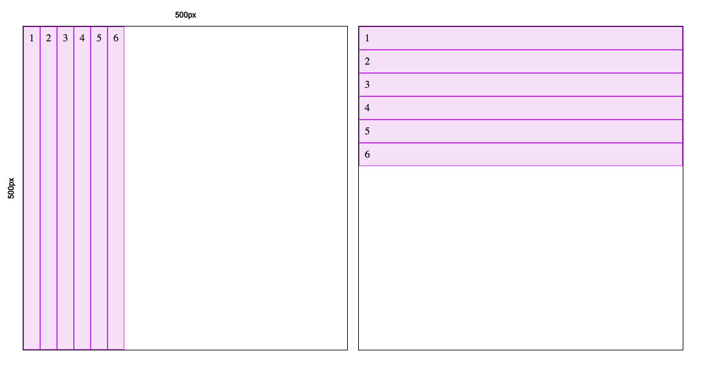
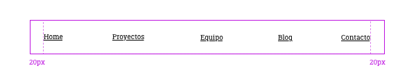
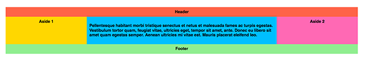

# Flexbox

## Contenidos

<!-- TOC depthFrom:4 depthTo:4 insertAnchor:false updateOnSave:true -->

- [EJERCICIO 1](#ejercicio-1)
- [EJERCICIO 2](#ejercicio-2)
- [EJERCICIO 3](#ejercicio-3)
- [EJERCICIO 4](#ejercicio-4)
- [EJERCICIO 5](#ejercicio-5)
- [EJERCICIO 6](#ejercicio-6)
- [EJERCICIO 7](#ejercicio-7)
- [EJERCICIO 8](#ejercicio-8)
- [EJERCICIO 9 BONUS](#ejercicio-9-bonus)

<!-- /TOC -->

## Introducción

Durante esta sesión veremos

- Algunas unidades de medida nuevas: `%`, `vh` y `vw`.
- Las propiedades `min-width`, `max-width`, `min-height` y `max-height`.
- Cómo distribuir los elementos en una página usando **Flexbox**.

## Unidades

En la lección anterior vimos los píxels (`px`), unidades absolutas, cuyo tamaño no varía. **Un píxel siempre es un píxel.** Veamos algunas unidades más.

### Unidad de porcentaje

La unidad de `%` nos permite ajustar tamaños para que sean un porcentaje del tamaño de su etiqueta madre.

```css
.hero {
	height: 33.3%;
}
```

### Unidades relativas al viewport

El **viewport** es la zona visible en una web. El viewport mide **100vw** (viewport width) de ancho y **100vh** (viewport height) de alto siempre, en la pantalla pequeña de un móvil o en la grande de un portátil.

Las unidades`vw` y `vh` nos permiten ajustar ancho y alto de manera relativa al *viewport*.

```css
.wrapper {
	height: 100vh;
}
```

### Tamaños mínimos y máximos

Con `max-width`, `min-width`, `max-height` y `min-height` podemos controlar los tamaños de los elemento para que sean fluidos, y se comporten como nosotras queremos frente a diferentes tamaños de ventanas del navegador.

```css
.box {
	width: 100%;
	max-width: 400px;
	min-width: 300px;
}
```

## Flexbox

Según la MDN, la propiedad Flexible Box, o flexbox, de CSS3 es un modo de diseño que permite colocar los elementos de una página para que se comporten de forma predecible cuando el diseño de la página debe acomodarse a diferentes tamaños de pantalla y diferentes dispositivos.

Hasta que apareció Flexbox la única manera de distribuir elementos en horizontal (por ejemplo: un menú horizontal, o un bloque principal y uno secundario) era calculando el espacio que debe ocupar cada bloque y controlando mucho que ningún elemento se saliese de lo planificado. Eran otros tiempos...

Flexbox es una herramienta imprescindible en la maquetación actual y nos permite tener elementos HTML que se ajusten a las diferentes pantallas de los diferentes dispositivos.

### En qué casos se utiliza

Pues hay casos muy evidentes, como hacer un pie fijo cuando hay poco contenido, o un panel lateral con una parte fija y otra flexible. Pero también hay otros más simples como un menú horizontal, un listado de iconos de redes sociales o una noticia donde queremos que a veces la imagen vaya arriba o tras el texto.
Básicamente lo podemos / querremos usar en cualquier estructura que se distribuya en vertical u horizontal y sobre la que queramos controlar el espaciado, orden o alineamiento.

### Guía de Flexbox

Os recomendamos leer la Guía de [Flexbox en CssTricks](https://css-tricks.com/snippets/css/a-guide-to-flexbox/). Por cierto [csstricks.com](https://css-tricks.com/) es una página de referencia entre maquetadores por la calidad de sus tutoriales y artículos.

Una vez que hemos leído la guía en CssTricks y conocemos todo lo que se puede hacer con Flexbox os dejamos este [vídeo con un resumen de los conceptos más usados](https://youtu.be/NUZ-2unOi98) y el [código que usamos en el vídeo](https://github.com/Adalab/ejercicios-extra/tree/master/css-flexbox).



### Pasos a seguir para hacer un buen Flexbox

Hasta que dominemos Flexbox os sugerimos tener siempre a mano esta chuleta:

#### ¿A quién afecta flex?

- Con flex solo son afectados el contenedor `.container` y sus hijos directos `.item`.
- Los nietos del contenedor **NO** se ven afectados.

#### ¿Dónde debemos aplicar los estilos?

- Los estilos del contenedor (dirección, distribución...) los aplicamos en el contenedor.
- Los estilos comunes a todos los hijos los aplicamos a una clase común para todos los hijos: `.item`.
- Si uno de los hijos tiene una disposición o tamaño diferente a la de los demás hijos, se le aplica estilos solo a ese elemento con una clase propia, por ejemplo `.item-x`.

#### Procedimiento normal

1. Se recomienda aplicar `box-sizing` y `border` o `background-color` al contenedor y a los hijos para visualizar cómo se comportan (después se pueden borrar estos estilos).
1. Indicar en el contenedor: `display: flex`.
1. **Indicar en el contenedor la dirección del eje principal:** `flex-direction`: `row`, `column`....
No hay que confundir eje principal con eje horizontal, ni eje secundario con eje vertical.
**Hay que tener muy muy claro cuál queremos que sea el eje principal y cuál el secundario.**
1. **Indicar en el contenedor si queremos que los items salten de línea** o se mantengan en una sola: `flex-wrap: wrap`. A lo mejor es necesario añadir muchos hijos para poder ver el salto de línea.
1. Indicar en el contenedor cómo se alinean o distribuyen los items en el eje principal, en el caso de que sobre o falte espacio: `justify-content: center`.
1. Indicar en el container cómo se alinean o distribuyen los items en el eje secundario: `align-items: center`.
   - Alguna vez pensaréis que estáis utilizando `justify-content` o `align-items` y no funciona. Es posible que sea porque no hay espacio sobrante, y por lo tanto no puede añadir espacio entre los hijos.
1. **Indicar a todos los items el tamaño** que deben tener: ancho si el eje principal es horizontal o alto si el eje principal es vertical.

#### Procedimiento avanzado

8. Si queremos indicar un ancho variable en función del espacio sobrante o el espacio faltante, usamos: `flex-grow`, `flex-shrink`.
1. Si queremos indicar un ancho inicial antes de repartir el espacio sobrante o faltante, usamos: `flex-basis`.
1. Si queremos usar un ancho fijo usamos: `width`.
1. Para indicar en un item un tamaño especial que debe tener: `flex-grow`, `flex-shrink` y `flex-basis`.
1. Si queremos cambiar el orden de los hijos le aplicamos order a uno de ellos, teniendo en cuenta que órdenes menores de 1 se moverán a la izquierda y mayores de 1 se moverán a la derecha.

> **Nota:** aquí estamos usando los nombres de clase `container` y `item` porque nos apetece. Podríamos haber usado otros nombres de clase que queramos.

#### EJERCICIO 1

**Flex y flex direction**



1. Crear un contenedor flex de 500px por 500px y con 6 o más elementos.
1. Hacer que se distribuyan en horizontal o vertical
1. Indicar cuál es el eje principal

\_\_\_\_\_\_\_\_\_\_

#### EJERCICIO 2

**FLEX WRAP**


Teniendo una lista de 10 a 15 imágenes de 200x100 px, hacer un bloque flexbox donde las imágenes se distribuyan por el eje horizontal y se vayan apilando uno detrás de otro.

\_\_\_\_\_\_\_\_\_\_

#### EJERCICIO 3

**Justify content y align items**



1. Hacer un menú horizontal con un contenedor flex de 100px de alto
1. Las opciones de menú serán:
	* Home
	* Proyectos
	* Equipo
	* Blog
	* Contacto
1. Hacer que se distribuyan horizontalmente ocupando todo el espacio disponible, que la primera opción esté a 20px del borde izquierdo, y la última esté a 20px del borde derecho
1. Todos los textos deben aparecer centrados verticalmente en el contenedor de 100px
1. El espacio restante debe usarse para separar las opciones de menú, unas de otras

\_\_\_\_\_\_\_\_\_\_

#### EJERCICIO 4

**Order**


1. Hacer un listado de noticias con imagen, título y párrafo de contenido
1. Meterlas en un contenedor flex y hacer que se distribuyan en dos columnas
1. Elegir una noticia, por ejemplo, la última, y ponerla como destacada, en primer lugar y ocupando las dos columnas

\_\_\_\_\_\_\_\_\_\_

#### EJERCICIO 5

**Flex, grow, shrink y basis**


Hacer una página con `<header>`, `<main>` y `<footer>` y hacer que aunque haya poco contenido el footer siempre está abajo de la página y el main ocupe todo el espacio disponible.
Si hubiese mucho contenido el footer debe colocarse tras el main, de forma natural.

> **Pista**: Tendremos que apoyarnos en `min-height` y `vh` para realizar este ejercicio.

\_\_\_\_\_\_\_\_\_\_

#### EJERCICIO 6



Convertir la imagen anterior a código usando HTML y CSS y lo que habéis aprendido hoy de Flexbox. Los requisitos son los siguientes:

- Las medidas tienen que ser relativas, es decir, los elementos de la página deben adaptarse al ancho de la ventana del navegador web. Si el tamaño de la ventana aumenta, el tamaño de los elementos debe aumentar.
- El ancho del conjunto entero debe ser del 100% con un ancho máximo de 960px
- Cada bloque debe de crearse con una etiqueta HTML5 (header, footer, aside...) y debe tener un título que esté centrado (como aparece en la imágen). El bloque central (que sería un article), en vez de tener un título, tendrá un párrafo con un texto aleatorio, podéis escribir dentro de él lo que queráis.

\_\_\_\_\_\_\_\_\_\_

#### EJERCICIO 7


Convertir la imagen anterior a código usando HTML y CSS y lo que habéis aprendido hoy de Flexbox. Los requisitos son los siguientes:

- En este caso si el tamaño de la ventana aumenta solo aumentará el tamaño del bloque central, el bloque gris de la izquierda y el grupo que compone la puntuación, texto y estrella de la derecha siempre tendrán el mismo tamaño (ejemplo abajo)
- El ancho del conjunto entero debe ser del 100% con un ancho máximo de 840px. Para el bloque gris de la izquierda debéis buscar una imagen cuadrada y colocarla ahí
- No os preocupeis por el tamaño de cada elemento, lo importante es que el resultado tenga una composición similar
- Para redondear los bordes debéis usar border-radius con unidades en píxel (por ejemplo, border-radius: 5px)

Si tenéis cualquier duda, preguntad.

\_\_\_\_\_\_\_\_\_\_

#### EJERCICIO 8

Crear una página con un texto simple centrado que ocupe el 100% de la pantalla hasta un máximo de 600 píxeles. Este texto deberá tener un título, un autor y una fecha de creación organizado de la siguiente forma.

Además deberá tener una cabecera con un fondo que ocupe toda la pantalla y un contenido que ocupe el mismo ancho que el texto. A su vez, tendrá que tener también un footer que se quede pegado en la parte inferior de la página. Cuando haya poco texto se mantendrá ahí y cuando aparezca mucho más texto se irá hacia abajo, siempre al final de la página.

Ejemplo de la página cuando el texto es largo


Ejemplo de la página cuando el texto es corto


Es importante utilizar flexbox para los elementos del header de la página y el footer. Si tenéis cualquier duda, preguntad.

\_\_\_\_\_\_\_\_\_\_

## BONUS

#### EJERCICIO 9 BONUS

En el siguiente [codepen](https://codepen.io/adalab/pen/BmQaQa) variad las dimensiones en vw y vh para:

- hacer que el contenedor `.box` ocupe el 50% de ancho y el 100% de alto
- hacer que el contenedor `.box` ocupe el 10% de ancho y el 10% de alto
- hacer que el contenedor `.box` ocupe el 100% de ancho y el 80% de alto

\_\_\_\_\_\_\_\_\_\_

## Recursos externos

##### Juegos para aprender flexbox

- [Flexbox froggy - juego](http://flexboxfroggy.com/#es)
- [Flexbox defense - juego (inglés)](http://www.flexboxdefense.com/)

##### Página interactiva para aprender flexbox

- [Página interactiva para aprender flexbox](http://codepen.io/enxaneta/full/adLPwv/)

##### Guía completa de Flexbox (inglés)

- [Guía completa de Flexbox](https://css-tricks.com/snippets/css/a-guide-to-flexbox/)
