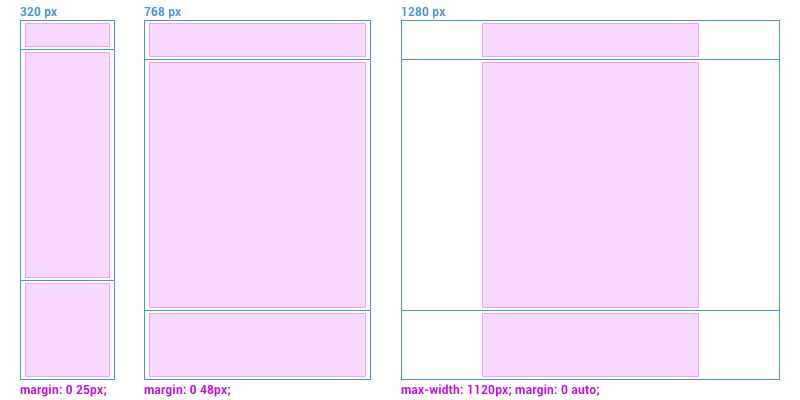
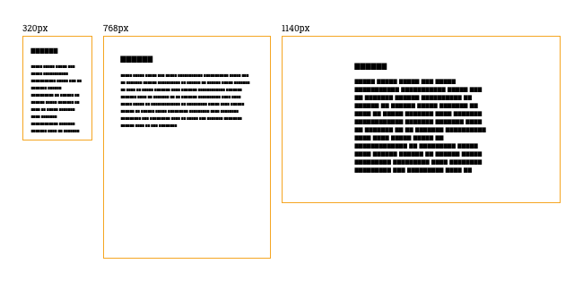
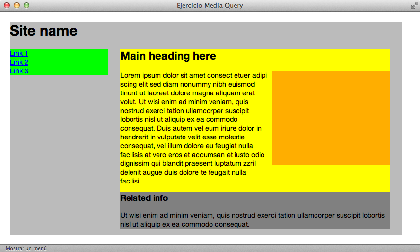
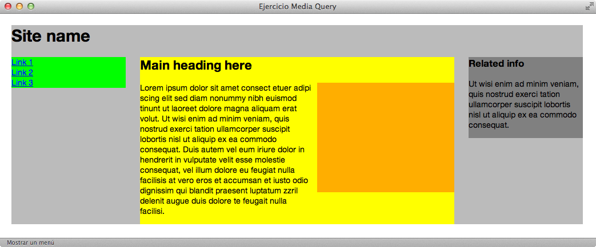

# Responsive design

## Contenidos

<!-- TOC depthFrom:4 depthTo:6 updateOnSave:true withLinks:true -->

- [EJERCICIO 1](#ejercicio-1)
- [EJERCICIO 2](#ejercicio-2)
- [EJERCICIO 3](#ejercicio-3)
- [EJERCICIO 4](#ejercicio-4)
- [EJERCICIO 5](#ejercicio-5)
- [EJERCICIO 6](#ejercicio-6)
- [EJERCICIO 7](#ejercicio-7)
- [EJERCICIO 8](#ejercicio-8)
- [EJERCICIO 9](#ejercicio-9)

<!-- /TOC -->

## Introducción

Durante esta sesión aprenderemos a usar las mediaqueries para modificar el contenido de nuestra página en función de la disposición de la pantalla, el tipo de dispositivo en el que se va a mostrar o el tamaño de la ventana de visualización de este último.

## ¿Qué es diseño flexible?

Antes de meternos con la maquetación responsive vamos a mirar a lo que podría ser un antecesor: el diseño flexible, o líquido.

Se dice que un diseño es líquido, o más correctamente, que una maquetación es líquida cuando definimos todos los anchos de los contenedores en términos de porcentajes de la vista del navegador, así pueden expandirse y contraerse cuando la ventana del navegador cambie de tamaño.

Muchas webs se maquetaban así cuando el tema de las pantallas y dispositivos no era todavía un problema. Cuando empezaron a salir las primeras pantallas diferentes (800x600 y 1024x768) esta maquetación por porcentajes te permitía tener ese margen entre unas dimensiones y otras.

Con el paso del tiempo, hemos visto que el problema ya no se resuelve teniendo algo de margen ya que a día de hoy tenemos pantallas que van desde los 320px de ancho hasta los 2560x1440. Aquí es donde entra el diseño responsive.

## ¿Qué es responsive?

El responsive, o Responsive Web Design (RWD) es un concepto de desarrollo orientado a que los sitios web se vean y comporten correctamente en todos los dispositivos y pantallas.

> **Nota:** Responsive no es solo móvil, tablet y escritorio, también es un navegador que ocupe la mitad de la pantalla por alguna razón. Por ejemplo, estamos escribiendo un artículo en nuestro editor de textos y tenemos al lado una web donde consultamos información.

Esto se consigue combinando varios enfoques:
- Maquetaremos ciertas zonas usando porcentajes
- Ciertos elementos se ajustarán al tamaño del contenedor hasta un cierto valor, es decir, se comportan como si tuviesen las medidas por porcentajes pero pudiendo marcar tamaños máximos y mínimos
- Usaremos unidades "flexibles" en ciertos casos, como `rem` o `vw` y `vh`. Y claro, el `%`
- Tenemos a nuestra disposición unas expresiones CSS, las mediaqueries, que nos permiten aplicar una serie de reglas cuando en nuestro navegador se cumplen unas condiciones: ancho, alto, resolución, orientación...
- Veremos qué es el viewport y cómo usarlo

[Curso en video de Responsive Design](https://www.youtube.com/playlist?list=PLQCgNGUqLK4mW7LxW3jJdRjCnErL5rszl)

## Imágenes, media y tipografía flexibles

### Imágenes

En este entorno Responsive las imágenes y videos tienen su forma de afrontarse y aunque ambos formatos podemos dimensionarlos por porcentajes tenemos varios casos en los que la imagen o el vídeo queda demasiado grande o demasiado pequeño. Para ello tenemos unas propiedades que matizan el `width` (ancho) o el `height` (alto):

- max-width
- min-width
- max-height
- min-height

De esta manera no solo podemos definir un ancho/alto en porcentajes sino marcar unos límites.

Por ejemplo: Quiero que mi imagen se ajuste al 100% del contenedor pero solo hasta un máximo de 600px, controlando de esa manera que se haga demasiado grande.

En maquetación responsive es súper buena idea meter las imágenes de contenido en un contenedor, dar a la imagen un ancho del 100% y usar el contenedor para definir el tamaño que debe tener la imagen. Esto se hace para poder controlar diferentes imágenes cuando no podemos asegurar los tamaños que van a tener sin que nos interfiera con la estructura.

[&rtrif; Ejemplo de imagen "responsive" en Codepen](https://codepen.io/adalab/pen/XxVGQB)

### Vídeos

Los vídeos son más complicados de controlar porque la etiqueta `<video>`, al contrario que la `` no redimensiona proporcionalmente el video, aunque hay formas de suplirlo ya sea por CSS o tirando de unas librerías en JS.

### Tipografía

Para el tema de la tipografía hay varias escuelas y formas de afrontarlo según el caso:

- Una es usar unidades fijas como los píxels, e indicarle en cada caso qué tamaño de fuente debe tener cada texto. Por ejemplo: en móvil mi texto básico será de 18px porque la pantalla es más pequeña y quiero que se lea mejor, pero en tablet lo bajo a 16px y en escritorio lo vuelvo a poner a 18px. Aunque en pantallas muy grandes usaré 20px o 24px.
- Tenemos unas unidades relativas como los `rem`

`rem`: es una unidad relativa al tamaño de texto especificado en el elemento raíz de nuestro documento que es el `<html>`. De manera que si el elemento `html` está a 16px (valor por defecto) 1rem equivaldrá a esos 16px.

Esto nos ayuda a poder ajustar todas nuestras medidas de forma proporcional solo cambiando el tamaño de fuente de la etiqueta `<html>`.

[&rtrif; Veamos un ejemplo en Codepen](https://codepen.io/adalab/pen/WadWay) (Prueba a cambiar el tamaño de fuente de la etiqueta html).

**¡En el nombre de la diosa frontender! ¿Cómo vamos a calcular los rems que corresponden a nuestros píxels?**

Pues con una [calculadora de rem](https://offroadcode.com/rem-calculator/) (por ahora).

#### EJERCICIO 1

**No puedo vivir sin rems**

Partiendo de estos documentos:

**index.html**

```html
<!DOCTYPE html>
<html lang="en">
<head>
  <meta charset="UTF-8">
  <meta name="viewport" content="width=device-width, initial-scale=1.0">
  <link rel="stylesheet" href="styles/main.css">
  <title>:)</title>
</head>
<body>
  <div class="smiley">:)</div>
</body>
</html>
```

y

**main.css**

```css
html {
  font-size: 16px;
}
.smiley {
  width: 100px;
  height: 100px;
  line-height: 100px;
  text-align: center;
  font-family: 'courier new';
  font-weight: bold;
  font-size: 50px;
  color: #424242;
  background: #ffcc00;
  position: fixed;
  left: 50%;
  top: 50%;
  transform: translate(-50%, -50%);
  border-radius: 50%;
}
```

1. Pasar las medidas en píxels a rem
1. ¿Qué tamaño de fuente tengo que poner para que mi careto mida 50x50?
1. ¿Y para que mida 200x200?

\_\_\_\_\_\_\_\_\_\_

## Max-width, min-width, max-height, min-height.

Estas propiedades que permiten "limitar" anchos y altos se pueden aplicar a casi cualquier contenedor (que admita dimensiones, como aquellos con display block o inline-block) de manera que podamos tener elementos que se dimensionen a base de porcentajes pero sobre los que tengamos un poco de control para que en determinados escenarios no se hagan demasiado pequeños ni demasiado grandes.

#### EJERCICIO 2

Ya vimos en la sesión de flexbox, en este [codepen](https://codepen.io/adalab/pen/LORKzX) tenemos dos columnas, una (`aside`) que ocupa el 50% del ancho hasta 320px y la otra (`.main`) que ocupa el resto:

- Tirando con el ratón, redimensionar la ventana del navegador haciéndola tan pequeña como para que las dos columnas ocupen lo mismo
- y agrandar hasta que `.aside` se quede en 320px de ancho mientras `.main` ocupa el resto del espacio

\_\_\_\_\_\_\_\_\_\_

#### EJERCICIO 3

En el siguiente [codepen](https://codepen.io/adalab/pen/MOjMPr) hay un módulo con una noticia sobre Bill Murray. Nada nuevo, ¿no?

- ¿Qué pasa si duplico el párrafo de texto?
- ¿Y si duplico otra vez?

\_\_\_\_\_\_\_\_\_\_

## Mediaqueries

Las mediaqueries son las instrucciones que nos permiten aplicar una serie de reglas CSS cuando se cumplan una o varias condiciones. Tienen este aspecto:

```css
@media all and (min-width:500px) {
	/* Reglas CSS que aplicaremos */
}
```

En el ejemplo superior le decimos que aplique unos CSS cuando estemos en una ventana de navegador de al menos 500px.

#### EJERCICIO 4

Crea un `index.html` que contenga:

```html
<!DOCTYPE html>
<html lang="en">
<head>
	<meta charset="UTF-8">
	<title>Viewport Sample</title>
</head>
<body>
	<div class="box"></div>
</body>
</html>
```

1) Sin que sirva de precendente, incluiremos una etiqueta `<style>` en el `<head>` con:

```css
.box {
	background: red;
	height: 100px;
}
```

Veremos que el div `.box` ocupará el ancho disponible y tendrá 100px de alto, y fondo rojo.

2) Añadamos nuestra primera mediaquery: vamos a hacer que por encima de 550px el elemento `.box` tenga fondo azul. Para ello el CSS dentro de nuestra etiqueta `<style>` quedará así:

```css
.box {
	background: red;
	height: 100px;
}
@media all and (min-width:550px) {
	.box {
		background: blue;
	}
}
```

Si ahora redimensionamos la ventana del navegador veremos que a partir de 550px de ancho nuestro elemento `.box` se vuelve azul.

> **Nota:** A cada una de estas medidas que ponemos en los mediaqueries las llamamos breakpoints, o puntos de ruptura.

3) Abramos ahora las herramientas de desarrollo de Chrome y lancemos el simulador de dispositivos móviles. Probemos varios dispositivos o resoluciones. ¿Qué pasa? ¿Cuándo se vuelve azul? ¿Cuándo se vuelve rojo?

Si no lo tenemos claro los siguientes ejercicios nos va a ayudar a entenderlo mejor.

\_\_\_\_\_\_\_\_\_\_

## Viewport

Aquí es donde entra en juego una etiqueta que la conocíamos por otros motivos pero que ahora tiene un contenido especial: el viewport.

```html
<meta name="viewport" content="width=device-width, initial-scale=1">
```

Los dispositivos móviles (teléfonos y tablets) utilizan este "viewport" para mostrar la página de una forma curiosa: salvo que se le indique lo contrario intentarán mostrarla al máximo tamaño posible, haciendo suficiente zoom para permitir que las páginas no adaptadas se puedan ver (aunque diminutas) por eso en nuestro ejemplo las mediaqueries no "funcionan".

Con la etiqueta `meta` viewport le decimos a estos dispositivos cómo tienen que comportarse. El ejemplo anterior es el más típico y le dice al viewport de un dispositivo móvil que:

1. el ancho del viewport debe coincidir con el ancho del dispositvo
1. la escala inicial siempre será el 100%

#### EJERCICIO 5

Vamos a añadir al `<head>` de nuestra página el tag meta viewport quedando toda nuestra página así:

```html
<!DOCTYPE html>
<html lang="en">
<head>
	<meta charset="UTF-8">
	<meta name="viewport" content="width=device-width, initial-scale=1">
	<title>Viewport Sample</title>
	<style>
		.box {
			background: red;
			height: 100px;
		}
		@media all and (min-width:550px) {
			.box {
				background: blue;
			}
		}
	</style>
</head>
<body>
	<div class="box"></div>
</body>
</html>
```

¿Qué tal ahora? ¿Si nos vamos a las herramientas de desarrollo, abrimos el simulador y probamos con diferentes dispositivos/anchos? ¿Cambia ahora de rojo a azul?

\_\_\_\_\_\_\_\_\_\_

## La columna central

Algo que no es muy obvio de ver al principio es la "columna central": normalmente, en diseño responsive, tenemos una columna central de contenido común a cada sección o módulo que mantiene una estructura a los largo de los diferentes breakpoints.

Para esto no hay unos números estándar pero es común que nos encontremos unos márgenes para móvil (320px), otros para tablet (768px) y un ancho fijo y centrado para las pantallas mayores:



Esto se consigue con un contenedor con una clase concreta que va incluido en todos nuestros bloques de manera que podamos mantener los márgenes coherentes en todo el site y tener secciones con fondos de color o imagen que ocupen el 100% del navegador.

Puedes ver un ejemplo en [este codepen](https://codepen.io/adalab/pen/WmerMe).

Un nuevo ejemplo de cómo maquetar la columna central es [este vídeo](https://www.youtube.com/watch?v=LbYSpU5I-9o).

#### EJERCICIO 6

Vamos a hacer algo más "real" y probamos a implementar esta "columna central". En un HTML tendremos un contenedor con:

1. Un título
1. Uno o dos párrafos de texto

Y vamos a plantear 3 escenarios (de pequeño a grande) según esta guía:



Vamos a empezar con el CSS de móvil e iremos ajustando los estilos según dispongamos de mayores tamaños de pantalla:

1. Por defecto:
	1. Nuestro contenedor tendrá 20px de margen a cada lado
	1. El título estará en negrita y a 32px
	1. El texto de los párrafos estará a 18px con un interlineado de 24px
1. De 768px en adelante:
	1. Nuestro contenedor tendrá 30px de margen superior y 40px de margen a cada lado
	1. El título estará en negrita y a 28px
	1. El texto de los párrafos estará a 16px con un interlineado de 20px
1. De 1140px en adelante:
	1. Nuestro contenedor tendrá 190px de margen superior y margen automático a cada lado, con un ancho máximo de 750px
	1. El título estará en negrita y a 42px
	1. El texto de los párrafos estará a 24px con un interlineado de 32px

\_\_\_\_\_\_\_\_\_\_

## Mobile first

Hay varias formas de afrontar la maquetación de un proyecto responsive, la que nos parece más adecuada es mobile first donde se plantean primero los estilos de la vista de móvil y conforme tenemos mayor tamaño de pantalla sobreescribimos o ajustamos los estilos necesarios.

La maquetación mobile first da prioridad a los dispositivos con menos capacidad de pantalla, conexión y batería de manera que, por ejemplo, se cargan imágenes más pequeñas que consumen muchos menos datos o se muestra una maquetación más simple y adaptada a que usemos los dedos como punteros (botones y zonas clicables más grandes). Y si luego resulta que estamos viendo la página en un una pantalla más grande, gracias a las mediaqueries, podemos cargar elementos más pesados, mostrar otros que en móvil pueden no tener sentido y adaptarlo todo a que ya se va a manejar con ratón y/o teclado.

Un ejemplo sería la típica página que tiene una primera sección con una imagen de fondo enorme: con la maquetación mobile first colocaríamos primero un fondo adaptado a una pantalla más pequeña con el consiguiente ahorro en nuestra tarifa de datos. Si alguien la carga desde escritorio, donde suele tener una conexión con tarifa plana, pasaríamos a mostrar una imagen de fondo mucho más grande, acorde a la pantalla que esté usando. Pero nunca obligamos a quien va en el metro a descargarse una imagen descomunal de chopocientos megapíxels en su móvil con una tarifa de datos que se paga con sangre.

En el CSS esto se representa escribiendo primero los CSS que se verán en las pantallas/ventanas de navegador más pequeñas. Posteriormente añadiremos, dentro de mediaqueries, los ajustes necesarios para los tamaños mayores de pantalla o ventana.

> **Nota:** Recordemos que responsive no es solo tema de dispositivos. Claro que hay móviles de 320, tablets de 768 y pantallas desde 1336 a 2560 de ancho. Pero responsive también es un tipo en una pantalla más modesta, por ejemplo cuando una usuaria pone el navegador en la mitad de la pantalla mientras trabaja y en la otra mitad pone un reproductor de vídeo porque está enganchada a Juego de Tronos...

### Entonces, ¿cuántos breakpoints hay? ¿hay unos más estándar que otros?

Realmente hay una serie de anchos que se tienen más en cuenta que otros. por ejemplo, un tablet suele tener de 768px (en vertical) a 1024px (en horizontal). En ordenadores de escritorio hay una serie de anchos que se suelen repetirse en los diseños (1280, 1500, 1600)...

Todo esto es muy relativo pero cuando el equipo de diseño entrega un diseño suele hacer de 2 a 3/4 vistas, y tomaremos esas medidas como nuestros breakpoints principales. El objetivo es clavar el diseño en esos puntos.

Luego tendremos breakpoints menores que nos los da el contenido: desde el tamaño más pequeño vamos redimensionando el navegador y cuando algo "se rompe" (o se descoloca), creamos un breakpoint y arreglamos lo que se haya roto o descolocado.

De esta manera nos aseguramos de que en cualquier ventana de navegador nuestra página se va a ver correcta. Quizás no se vea de una manera ideal, pero no se va a ver descolocada.

## BONUS: vw y vh

De postre, tenemos unas unidades flexibles que no dependen de un tamaño de fuente como los `rem` sino que dependen de las dimensiones del viewport o de la ventana del navegador. Son los `vw` y `vh` (viewport width y viewport height).

A efectos prácticos actúan como un porcentaje en función del ancho/alto del viewport/ventana del navegador. Entonces, el 100% de la altura de nuestra ventana de navegador sería 100vh.

#### EJERCICIO 7

En el siguiente [codepen](https://codepen.io/adalab/pen/BmQaQa) variad las dimensiones en vw y vh para:

- hacer que el contenedor `.box` ocupe el 50% de ancho y el 100% de alto
- hacer que el contenedor `.box` ocupe el 10% de ancho y el 10% de alto
- hacer que el contenedor `.box` ocupe el 100% de ancho y el 80% de alto

\_\_\_\_\_\_\_\_\_\_

#### EJERCICIO 8

Hacer una web que, en función del ancho de la ventana del navegador, cambie su color de fondo:

- Si el tamaño de la ventana es menor de 480px que tenga el fondo rojo
- Si el tamaño de la ventana está entre 480px y 768px que tenga el fondo amarillo
- Si el tamaño de la ventana es mayor de 768px que tenga el fondo verde

\_\_\_\_\_\_\_\_\_\_

#### EJERCICIO 9

Dados los siguientes diseños, maquetar la web aplicando las mediaqueries necesarias.

Aspecto de la web en una pantalla de 480px


Aspecto de la web en una pantalla entre 480px y 1000px



Aspecto de la web a pantalla completa (por encima de 1000px)



\_\_\_\_\_\_\_\_\_\_

## Recursos externos

- [Curso de Responsive Design](https://www.youtube.com/playlist?list=PLQCgNGUqLK4mW7LxW3jJdRjCnErL5rszl)
- [CSS: Media queries (video)](https://www.youtube.com/watch?v=y6zYUe7MdLQ)
- [Por qué mobile first es importante hoy](https://www.youtube.com/watch?v=SEXm5OM-U3s)
- [Cómo aplicar el mobile first y el responsive design](https://www.youtube.com/watch?v=KjHRa_Qzus8&index=8&list=PL6hPvfzEEMDaKYAabXoDL7A-fZcwxvIqe)

## Bonus: em

`em`: 1em es una unidad relativa que depende del tamaño de texto de nuestra madre: Si el body está a 14px y a una hija inmediata, un `<div>`, le especificamos un tamaño de fuente de 1em, ese 1em valdrá 14 píxeles.

El tamaño de fuente por defecto que los navegadores usan antes de aplicar CSS es de 16 píxeles, lo que significa que este es el valor asignado por defecto a un elemento (1em). Ojo — los tamaños de fuente de los elementos se heredan de las madres, por lo que si a las madres se les aplica otros tamaños de fuente, la equivalencia en píxel de un em puede complicarse.


Los `em` son estupendos para modificar un módulo de manera proporcional.
Vamos a ver cómo funcionan en un ejemplo unas unidades flexibles como los `em` y qué pueden hacer por nosotros:
En el siguiente [codepen](https://codepen.io/adalab/pen/vWXwZd) hay un contenedor con clase `.icon`. Y él y todas sus hijas están en `em`.
Probar a diferentes valores de píxels para el font-size del elemento `.icon`:

- 10px
- 16px
- 50px
- 100px
