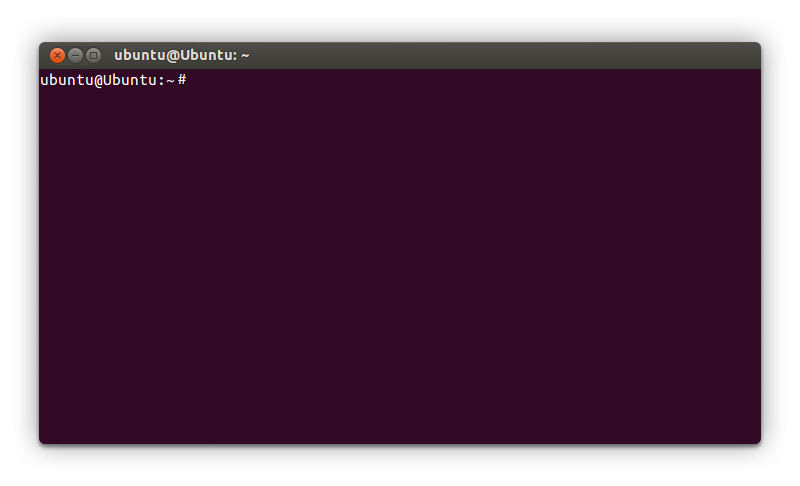

# Publicando nuestra web

## Contenidos

<!-- TOC depthFrom:4 depthTo:4 -->

- [EJERCICIO 1](#ejercicio-1)
- [EJERCICIO 2](#ejercicio-2)
- [EJERCICIO 3](#ejercicio-3)
- [EJERCICIO 4](#ejercicio-4)
- [EJERCICIO 5](#ejercicio-5)
- [EJERCICIO 6](#ejercicio-6)
- [EJERCICIO 7](#ejercicio-7)
- [EJERCICIO 8](#ejercicio-8)
- [EJERCICIO 9](#ejercicio-9)
- [EJERCICIO 10](#ejercicio-10)
- [EJERCICIO 11](#ejercicio-11)
- [EJERCICIO 12](#ejercicio-12)
- [EJERCICIO 13](#ejercicio-13)

<!-- /TOC -->

## Introducción

La lección de hoy es amplia y variada. Vamos a aprender a trabajar con la terminal, una herramienta fundamental en la programación. También vamos continuar avanzando con nuestros conocimientos de Git y GitHub. Y al final de la lección vamos a aprender cómo publicar nuestra web en el servidor de GitHub Pages.

> **NOTA:** La lección de hoy es doble, en ella hablamos de la terminal y de Git / GitHub. Debemos repartir nuestro tiempo de estudio entre ambas partes.

## La terminal

> **Nota:** Antes de comenzar a trabajar con la terminal debes haber realizado la [Guía de instalación de la terminal](../informacion-de-interes/antes_de_empezar_el_curso/instalacion_de_la_terminal).

**La terminal, también llamada consola de comandos, es una herramienta fundamental** para la programación. Su finalidad es ejecutar **comandos u órdenes** mediante instrucciones. Estos comandos son similares a las interacciones que haríamos en una aplicación normal (clics, escribir en campos, cambiar de sección, etc.) pero en este caso se hacen **escribiendo órdenes** en una terminal de comandos.

Muchas de las herramientas para programación están hechas sin interfaz porque son **tan sencillas que no merece la pena** hacer un interfaz o **son tan complejas que no se puede hacer un interfaz gráfica** que tenga todas las funcionalidades posibles. La solución es usar la terminal.

Cuando una persona utiliza un programa como VS Code o Chrome está utilizando **una interfaz gráfica que transforma nuestras acciones en órdenes** que le envía al sistema operativo a través de una terminal. Es decir las aplicaciones son intermediarias. Cuando utilizamos la terminal directamente **no hay nada que se interponga entre el sistema operativo y nosotras**. Tenemos todo el poder, y toda la responbilidad claro ;)



Como vemos en la imagen, la terminal nos muestra una línea, el **prompt**, a partir de la cual podemos escribir nuestros comandos. El prompt está compuesto por:

- Nombre del usuario con el que hemos iniciado sesión en el ordenador.
- @
- Nombre del equipo u ordenador.
- Ruta de la carpeta en la que está ahora mismo la terminal:
   - Puede ser la ruta absoluta de una carpeta.
   - Puede ser `~` que es una abreviatura de la carpeta **home** del usuario.
- Por último el símbolo del dólar, que es simplemente para saber dónde termina el prompt y dónde podemos empezar a escribir un comando.

Ejemplos:

```shell
ubuntu@ubuntu: ~$
```

```shell
maricarmen@hp: /mnt/c/Users/maricarmen/Desktop/Adalab/ejercicios$
```

> **NOTA**: A veces, en nuestros materiales o en Internet, encontraremos ejemplos de comandos precedidos por el símbolo del dólar, por ejemplo `$ pwd`. Es una manera de decir que es un comando de terminal. Nosotras no debemos escribir el `$` en la consola.

Y ya que hemos hablado de las rutas no podemos continuar con la explicación de la terminal, sin antes explicar lo qué son la rutas absolutas y relativas.

### Las rutas absolutas

Las rutas absolutas indican la **dirección completa** de una carpeta o fichero:

- Siempre empiezan con `/`. La `/` es la ruta raíz del ordenador.
- Si usamos una ruta absoluta **indicamos el camino que hay que recorrer desde la carpeta raíz** del ordenador a una carpeta o fichero.
- Por ejemplo `/user/maricarmen/adalab/proyectos/modulo-1/`.
- Por ejemplo `/user/maricarmen/adalab/proyectos/modulo-1/index.html`.
- Por ejemplo `/mnt/c/Users/maricarmen/adalab/proyectos/modulo-1/index.html`.

### Las rutas relativas

- Las rutas relativas indican **el camino que hay que recorrer** para ir desde la carpeta en la que estoy ahora mismo a otra carpeta o fichero.
- La ruta relativa más simple es `../` (dos puntos barra). Esta ruta **indica la carpeta madre o carpeta superior respecto a la carpeta actual**. Si la ruta relativa es el camino a recorrer, escribiendo la ruta `../` vamos de la carpeta actual a la carpeta madre. Si escribimos la ruta `../../` vamos de la carpeta actual a la carpeta abuela. Y así sucesivamente...
- Otra ruta relativa muy simple es `./` (punto barra). Esta ruta indica la carpeta en la que estoy, mi carpeta actual. Si la ruta relativa es el camino a recorrer, escribiendo la ruta `./` vamos de la carpeta actual a la carpeta actual. Esto parece que no tiene mucho sentido, en seguida veremos que sí lo tiene.

Vamos a ver un ejemplo de rutas relativas:

```
adalab/
├ proyectos/
├┬ modulo-1/
│└┬ css/
│ │ └ styles.css
│ ├ images/
│ │ └ logo.jpg
│ └ index.html
└─ modulo-2/
```

Pensemos que estoy en la carpeta `proyectos/` y quiero *caminar* hasta la carpeta `modulo-1/`. La ruta a usar es `./modulo-1/`. Es decir, desde `proyectos/` entro en `modulo-1/`.

Ahora pensemos que estoy en la carpeta `proyectos/` y quiero *caminar* hasta la carpeta `images/`. La ruta a usar es `./modulo-1/images/`. Es decir, desde `proyectos/` entro en `modulo-1/`. Después desde `modulo-1/` entro en `images/`.

Ahora pensemos que estoy en la carpeta `css/` y quiero entrar en la carpeta `images/`. La ruta a usar es `../images/`. Primero subo a la carpeta madre que es `modulo-1/` pero no necesito saber el nombre de la carpeta madre porque me vale con poner `../`. Desde la carpeta madre entro en la carpeta `images/`.

### Rutas dentro de ficheros

Cuando nos movemos por la terminal podemos usar rutas absolutas o relativas.

Pero **cuando escribimos la ruta desde dentro de un fichero a otro fichero debemos usar siempre rutas relativas**. Esto se debe a que cuando estamos programando una página, los ficheros están en mi ordenador. Pero si los subo a GitHub y una compañera se los baja, ella los tendrá en una ruta absoluta diferente a la mía.

Por ejemplo desde un `index.html` importamos la hoja de estilos usando `<link rel="stylesheet" href="./css/styles.css">`. Usamos `./css/` para ir desde `index.html` a `styles.css`.

Pasa lo mismo cuando desde un fichero `styles.css` usamos una ruta a una imagen de fondo `background-image: url('../images/hero.png);`. Usamos `../images/` para ir desde `index.html` a `styles.css`.

> **BRICONSEJO:** Acuérdate de este importante consejo. Cuando pongas la ruta de un fichero dentro de otro, la ruta debe empezar con `./` o `../`. Siempre. Sin excepciones. Si alguna vez no lo haces, antes o después tendrás problemas y acabarás acordándote de este briconsejo.

Y ahora que ya sabemos cómo funcionan las rutas podemos aprender los principales comandos de la terminal. Te recomendamos que abras una consola y los pruebes.

### pwd (print working directory)

Principalmente usaremos la terminal para movernos por el sistema de archivos y carpetas del ordenador. Así que es fundamental saber dónde estamos en cada momento. El comando `pwd`se encargará de mostrarnos en qué carpeta nos encontramos.

```shell
pwd
```

Devolverá la ruta absoluta de la carpeta en la que estemos, con este aspecto:

```shell
/user/nombre-de-usuario
```

Nos estaría indicando que nos encontramos en la carpeta `nombre-de-usuario`, que está dentro de `user`, que está en la carpeta raíz de nuestro equipo.

Si estás trabajando en un Ubuntu integrado dentro de Windows 10 y pruebas `pwd` verás que el resultado es:

```shell
/mnt/c/Users/nombre-de-usuario
```

Es decir, en Windows 10 las unidades de nuestro ordenador como `c:\` se montan dentro de `/mnt/`, por ello la ruta `c:\Users\maricarmen` corresponde con `/mnt/c/Users/maricarmen`.

### ls (list)

El comando `ls` nos muestra un listado de los archivos y carpetas que hay en la carpeta actual. Podemos usar la opción especial `ls -a` para listar también los ficheros y carpetas ocultos. Los ficheros y carpetas ocultos empiezan por `.` y por defecto no se ven ;). Por ejemplo un fichero oculto es `.gitignore`.

### cd (change directory)

El comando `cd` nos ofrece diferentes posibilidades a la hora de cambiar de carpeta. Para entrar en una carpeta hija de la carpeta actual usamos:

```shell
cd nombre-de-carpeta-hija
```

O lo que es lo mismo:

```shell
cd ./nombre-de-carpeta-hija
```

Podemos encadenar varios nombres de subcarpetas separadas por `/` para llegar hasta una ruta más profunda:

```shell
cd nombre-de-carpeta-hija/carpeta-nieta/carpeta-bisnieta
```

También podemos escribir la ruta absoluta desde la raíz de nuestro equipo `/` a la carpeta a la que queremos entrar.

```shell
cd /ruta/absoluta/a/una/carpeta
```

Podemos escribir solo `cd` y nos mueve a la carpeta de nuestro usuario:

```shell
cd
```

`..` nos permite subir a la carpeta madre, esto es, ir a la carpeta que contiene nuestra carpeta actual

```shell
cd ..
```

O lo que es lo mismo:

```shell
cd ../
```

Y para ir a la carpeta hija de mi carpeta madre, lo que en cristiano significa ir a la carpeta prima:

```shell
cd ../carpeta-de-mi-prima-hermana
```

Este comando permite **deshacer o desandar** el último `cd` realizado. Vuelve a la localización anterior al último cambio de carpeta.

```shell
cd -
```

### mkdir (make directory)

Nos permite crear una carpeta. Pero no entra en la carpeta, solo la crea.

Para crear la carpeta `proyecto` escribimos el comando:

```shell
mkdir proyecto
```

Casi todos los comandos los podemos combinar con lo que ya sabemos de las rutas. Por ejemplo para crear una carpeta `proyecto` en la carpeta superior escribimos el comando:

```shell
mkdir ../proyecto
```

Y por ejemplo para crear una carpeta `proyecto` en la raíz del ordenador escribimos el comando:

```shell
mkdir /proyecto
```

### touch

Nos permite crear un nuevo archivo. Al igual que el comando `mkdir` se puede combinar con lo que ya sabemos sobre rutas. Para crear el fichero `index.html` usamos el comando:

```shell
touch index.html
```

En algunas terminales de Ubuntu y Windows también podemos limpiar usando los atajos de teclado `ctrl + l` o `ctrl + k`. Si estamos en Mac son `cmd + l` o `cmd + k`.

### cp (copy)

Para copiar ficheros (o carpetas) usamos el comando `cp` seguido del fichero (o carpeta) de origen, un espacio y la ruta del fichero (o carpeta) de destino:

```shell
cp fichero-de-origen.html ../carpeta-de-destino/fichero-de-destino.html
```

### mv (move)

Para mover ficheros (o carpetas) usamos el comando `mv` seguido del fichero (o carpeta) de origen, un espacio y la ruta del fichero (o carpeta) de destino:

```shell
mv fichero-de-origen.html ../carpeta-de-destino/fichero-de-destino.html
```

Este comando también sirve para renombrar, ya que renombrar un fichero de `a.html` a `b.html` es lo mismo que moverlo.

```shell
mv a.html b.html
```

### clear

A veces pasa que hemos introducido muchos comandos y sería genial poder limpiar la ventana. Para eso existe el comando `clear`.

```shell
clear
```

### Historial de comandos

Para movernos por los últimos comandos ejecutados usamos la teclas de flecha para arriba ⬆️ y para abajo ⬇️. Así nos ahorramos volver a escribir lo mismo muchas veces.

Si queremos buscar un comando en el historial, podemos usar `ctrl+r` y comenzar a escribir el comando para buscarlo.

### Ayuda y opciones

Si no sabemos cómo funciona un comando pediremos ayuda al terminal. Por ejemplo para saber cómo funciona el comando `ls` escribimos:

```shell
ls --help
```

El terminal mostrará una explicación de cómo se utiliza el comando y las opciones que se pueden utilizar. Con esta información sabremos que para listar el contenido de un directorio en orden inverso podemos escribir:

```shell
ls --reverse
```

o

```shell
ls -r
```

#### EJERCICIO 1

Desde la terminal, id a vuestra carpeta de documentos y cread la siguiente estructura de carpetas y archivos (vacíos):

```txt
nombre
    datos
        mis-datos.txt
    proyecto
        ruta-del-proyecto.txt
```

- En el archivo **mis-datos.txt** vamos a escribir el Nombre y la comida favorita.
- En el archivo **ruta-del-proyecto.txt** pondremos la ruta del archivo desde nuestra carpeta de `Documentos`
- Mover los dos archivos a la carpeta principal, que sería **nombre**

\_\_\_\_\_\_\_\_\_\_

#### EJERCICIO 2

Desde la terminal, vamos a crear un nuevo proyecto en nuestra carpeta de proyectos que se llame `rutas-relativas`, con las carpetas `images` y `styles`. Y los archivos `index.html` (en la raíz del proyecto), `style.css` (en la carpeta `styles`) y `imagen-de-prueba.jpg` (en la carpeta `images`, la podéis descargar desde [este enlace](assets/images/1-7/imagen-de-prueba.jpg)).

Ahora, editando el archivo `index.html` en VSCode se tiene que ver la imagen de dos formas:

1. Con un ``
2. Como fondo de un `div` del mismo tamaño que la imagen

¿Cómo es la ruta de ambas imágenes? ¿Absoluta? ¿Relativa?
¿Es diferente en los dos casos? ¿Por qué?

\_\_\_\_\_\_\_\_\_\_


## Git

### Introducción a Git

Vamos a ver una pequeña introducción a Git, para ello hemos seleccionado el siguiente video ya que pensamos que explica de forma breve y sencilla qué es Git y algunos de sus conceptos básicos.

- [1.- Curso Git - Introducción a Git](https://www.youtube.com/watch?v=zH3I1DZNovk)

### Configurar Git en nuestro ordenador

Vamos a ver cómo configurar Git en nuestro ordenador. Para llevarlo a cabo, primero comprobaremos si tenemos instalada una versión reciente de Git.

> NOTA:
> Para comprobar si tenemos instalado Git en nuestro ordenador, debemos abrir la Terminal y ejecutar el comando `Git --version`. Esto mostrará el texto `Git version` seguido de la versión de Git que tenemos instalada. Para poder trabajar de forma correcta, lo indicado sería que tuviésemos una versión igual o posterior a la `2.11.0`.

**1. Creamos una cuenta en [GitHub](https://github.com). Poniendo nuestro usuario de GitHub en minúsculas**

> Esto es súper importante y lo agradeceréis más adelante.

**2. Añadimos nuestro nombre a la configuración de Git**

Abrimos la aplicación de la terminal e introducimos el siguiente comando, tal y como se muestra abajo, sustituyendo `"John Doe"` por vuestro nombre. Una vez lo hayamos introducido, pulsamos intro para que se ejecute.

**Importante:** Escribiremos nuestro nombre entre comillas para evitar problemas a la hora de ejecutar el comando.

```shell
Git config --global user.name "John Doe"
```

**3. Configuramos nuestro email para trabajar con Git**

Ahora introducimos el siguiente comando para guardar la configuración de nuestro email:

```shell
Git config --global user.email "johndoe@example.com"
```

Sustituiremos en este caso `"johndoe@example.com"` por el email que **hemos utilizado para crear nuestra cuenta de GitHub**.

**Nota:** Es importante que el email coincida con el que hemos utilizado en GitHub, ya que se utilizará para comprobar nuestros credenciales a la hora de subir información a un repositorio en esta plataforma.

**4. Añadimos la configuración para que se guarde nuestra contraseña para GitHub**

Por defecto, cada vez que intentamos conectarnos con GitHub, el servidor de GitHub nos pedirá la contraseña de nuestro usuario. Como vamos a subir y descargar cambios de GitHub de forma constante, puede ser un poco molesto tener que introducir la contraseña cada vez que queramos conectarnos con el servidor. Para evitar esto, vamos a almacenar la contraseña de forma segura en nuestro ordenador.

**En Ubuntu**

Para poder almacenar la contraseña de GitHub en Ubuntu, realizaremos los siguientes comandos uno por uno:

```shell
sudo apt-get install libsecret-1-0 libsecret-1-dev
```

Nos solicitará una contraseña, aquí debemos introducir la contraseña de nuestro ordenador, no la de GitHub.

```shell
cd /usr/share/doc/Git/contrib/credential/libsecret
```

```shell
sudo make
```

```shell
cd -
```

```shell
Git config --global credential.helper /usr/share/doc/Git/contrib/credential/libsecret/Git-credential-libsecret
```

Al hacer esto, la próxima vez que introduzcamos nuestra contraseña de GitHub, esta se almacenará de forma segura en nuestro ordenador y no será necesario volver a introducirla de nuevo.

Una vez hayamos realizado ese paso, no necesitaremos hacer ningún cambio más.

**En Windows 10**

Para poder almacenar la contraseña de GitHub en Windows, realizaremos los siguientes comandos uno por uno, en la terminal de Ubuntu que instalamos el primer día del curso en la instalación de ordenadores:

```shell
sudo apt-get install libsecret-1-0 libsecret-1-dev
```

Nos solicitará una contraseña, aquí debemos introducir la contraseña que pusimos cuando instalamos Ubuntu dentro de Windows, no la de GitHub.

```shell
cd /usr/share/doc/Git/contrib/credential/libsecret
```

```shell
sudo make
```

```shell
cd -
```

```shell
Git config --global credential.helper "/mnt/c/Program\ Files/Git/mingw64/libexec/Git-core/Git-credential-manager.exe"
```

Al hacer esto, la próxima vez que introduzcamos nuestra contraseña de GitHub, esta se almacenará de forma segura en nuestro ordenador y no será necesario volver a introducirla de nuevo.

Una vez hayamos realizado ese paso, no necesitaremos hacer ningún cambio más.

**En Mac**

Para poder almacenar la contraseña de GitHub en Mac, simplemente ejecutamos el siguiente comando:

```shell
Git config --global credential.helper osxkeychain
```

Una vez hayamos realizado ese paso, no necesitaremos hacer ningún cambio más.

**5. Configuramos el editor de texto para trabajar con Git**

**Nano** es un editor de texto que suele venir por defecto en Ubuntu en la terminal. Queremos que sea nuestro editor por defecto para trabajar con Git. Para ello abrimos la terminal e introducimos el siguiente comando. Una vez lo hayamos introducido, pulsamos intro para que se ejecute.

```shell
Git config --global core.editor nano
```

El editor por defecto en otros sistemas operativos es otro, pero en este curso vamos a utilizar siempre Nano para trabajar todas de la misma manera.

### Cómo trabajar con Git

Para trabajar con Git lo haremos usando comandos a través de la Terminal, como comentábamos en la introducción de esta sesión. Para ello tendremos que aprender unos comandos básicos.

Una vez configurado Git en nuestro equipo tendremos que activar el control de versiones en nuestro proyecto, esto lo haremos con `Git init`. Este comando lo usaremos solo una vez en la carpeta de nuestro proyecto y activa que se controle cada cambio que hacemos a nuestros archivos del proyecto.

A partir de este momento, cada vez que hagamos cambios, Git sabrá qué archivos hemos modificado.

En cualquier momento podremos pedir que nos diga en qué estado está el proyecto con `Git status`, lo que nos dirá si hemos cambiado archivos.

Normalmente trabajaremos con cambios cortos o tareas pequeñas, y cuando hayamos terminado, querremos indicarle a Git que ya hemos terminado un paquete de cambios, para lo que tenemos dos comandos:

1. `Git add -A` para añadir los archivos que hemos modificado. Una vez añadidos Git sabrá qué cambios hemos hecho.
1. `Git commit -m "Mensaje"` nos permite crear como un paquete de cambios y "guardarlo en nuestro sistema de versiones", nos dejará escribir un mensaje corto para asociarlo al paquete de cambios o _commit_.
1. Si queremos ver la lista de commits realizados en un proyecto usaremos `Git log`. Para salir del listado usamos la tecla `q`.

En el video que añadimos a continuación se explican los comandos básicos para empezar a trabajar con Git.

- [3.- Curso Git - Nuestro primer proyecto](https://www.youtube.com/watch?v=vH9pkFf1D7M)

> **Nota:** En el video pone los mensajes de los commits en español pero nosotros los escribiremos en inglés.

**Mensaje del commit**

Es importante acompañar el commit con un mensaje. Este mensaje debe ser suficientemente corto para que no sea una locura leerlo y, a la vez, explique qué cambio se ha hecho de forma clara.

Normalmente trabajaremos con otras compañeras en un mismo proyecto y será fundamental que todas entiendan qué se ha hecho en cada paso para poder trabajar de forma más rápida y no tener que estar preguntando qué es cada cosa.
Crear mensajes claros en los commits, nos servirá también para que si volvemos a ver un commit del pasado, podamos entender qué es lo que hicimos.

A la hora de escribir un mensaje para un commit hay múltiples maneras de plantearlo e infinidad de guías. Como estamos empezando tengamos en cuenta sólo la siguiente serie de normas para crear un mensaje lo suficientemente bueno:

- Debe estar escrito en inglés
- Tiene que ser corto. Máximo 72 caracteres
- Debe explicar brevemente y a nivel general los cambios que se han hecho (añade el footer, corrige los enlaces del artículo, etc.)
- No tiene que detallar los cambios hechos en el código, sino en general. Recordemos que ya tenemos un control de versiones que muestra, exactamente, qué se ha hecho. (Ejemplo: no pongáis "Add 2 paragraph tags", poned mejor "Add introduction text")
- Usaremos el imperativo (Ejemplo: `Change header styles` - Cambia los estilos del header) para decir qué hace el commit.

Un ejemplo de un buen commit:

```
$ Git commit -m "Fix typo in article title"
```

#### EJERCICIO 3

Vamos a crear nuestro primer proyecto con Git, al que llamaremos `testing-Git`. Dentro de él, crearemos un archivo HTML con un título HEAD en el que ponga "Testing Git" y un `h1` con el mismo texto. Además, crearemos un archivo para los estilos (`main.css`) dónde añadiremos un estilo para que la familia de texto que se use en la web sea `sans-serif`. Organizaremos el proyecto siguiendo la estructura de siempre:

```txt
testing-Git
    styles
        main.css
    images
    index.html
```

Una vez creado el proyecto con el HTML y el CSS indicado. Inicializa el repositorio Git en el proyecto (asegurate de que estás en la carpeta testing-Git), añade los archivos y haz el primer commit con el mensaje `Initial commit`

```shell
Git init
```

```shell
Git add -A
```

```shell
Git commit -m "Initial commit"
```

\_\_\_\_\_\_\_\_\_\_

#### EJERCICIO 4

Modificar el archivo `index.html` para que en el título de la página ponga "My first Git project" y en el texto de la cabecera aparezca una sonrisa `:)`. Añadir los cambios y hacer un commit para guardarlos.

**Nota:** El mensaje del commit deberá explicar de forma clara los cambios que hemos realizado

\_\_\_\_\_\_\_\_\_\_

#### EJERCICIO 5

Vamos a realizar un tercer cambio dónde añadiremos un archivo `README.md` en la raíz de nuestro proyecto. Este archivo se utiliza para poner información acerca de nuestro código y, por defecto, la web GitHub lo muestra en la página principal de nuestro proyecto. Dentro de ese archivo escribiremos el siguiente texto:

```markdown
## My first Git project

Dummy project to learn Git basics
```

**Nota:** El mensaje del commit deberá explicar de forma clara los cambios que hemos realizado

\_\_\_\_\_\_\_\_\_\_

## GitHub

Como hemos explicado anteriormente, GitHub es una plataforma de desarrollo colaborativo para alojar proyectos utilizando el sistema de control de versiones de Git. Está muy enfocada a proyectos de código abierto y la verdadera fuerza de GitHub está en la comunidad tan grande que se ha montado sobre la idea de código abierto u _open source_ :)

#### EJERCICIO 6

Poneros, ambas compañeras, una imagen de perfil en vuestras cuentas de GitHub. No tiene por qué ser una fotografía.

\_\_\_\_\_\_\_\_\_\_

Hasta ahora sabemos crear un repositorio Git local, ahora vamos a ver cómo creamos un repositorio remoto en GitHub, de esta forma podremos acceder al código desde cualquier equipo y podremos colaborar con nuestras compañeras.

Para ello, nos vamos a nuestro perfil y buscamos el botón `+` para crear un nuevo repositorio:


Rellenamos los datos que nos piden: nombre del repositorio, descripción y marcamos que queremos inicializarlo con un `Readme.md`:


Una vez creado, nos llevará a la página principal de nuestro repo donde podremos conseguir la url para descargarlo en nuestro equipo. Esta es una descarga especial que llamamos, clonar, que nos hace una copia local del proyecto conectada con la versión remota.


Ahora, con esta url podemos irnos a nuestra terminal y clonarlo con `Git clone`:


Esto nos generará una carpeta con nuestro proyecto. **Recordad que crea la carpeta pero no nos mete dentro** por lo que tendremos que usar el comando `cd` de nuestra terminal para cambiar la ruta actual.

> **Nota**:
> Por defecto Git nos creará una carpeta con un nombre automático, si queremos un nombre específico para la carpeta de nuestro proyecto podemos declararlo tras la url que nos da GitHub:

```shell
Git clone url-del-repositorio-que-me-da-github nuevo-nombre-de-carpeta
```

Ahora tenemos un repositorio local en la carpeta en la que hemos clonado nuestro nuevo repositorio remoto.
Si accedemos a la carpeta, dentro debería estar el archivo README.md.

Podemos crear archivos y/o realizar cambios sobre los existentes, guardarlos en local (Ctrl+S o Cmd+S), añadirlos para que Git sepa que cambios hemos hecho (`Git add -A`), commitearlos con un mensaje (`Git commit -m "Add main css file"`), y finalmente hacer un _push_ al repositorio remoto de GitHub (`Git push origin master`) para guadar nuestros cambios allí.

### ¿Y si ya tengo un proyecto con Git en local?

A la hora de conectar el repo local y el remoto lo mas cómodo es empezar creando el repo en GitHub, clonándolo y seguir a partir de ahí con la conexión ya hecha. Pero puede pasar que ya tuviésemos un proyecto en local que hubiésemos inicializado con `Git init`, en este caso seguiremos estos pasos:

1. Creamos un repo vacío en GitHub **SIN INICIALIZARLO CON README.md, GITIGNORE O LICENCIA**.
2. Esto nos llevará a una página diferente con las instrucciones para conectar un repo local con nuestro repo remoto:


3. Copiamos la línea con `Git remote add origin url-del-repositorio-que-me-da-github`
4. Desde la terminal, nos vamos a la carpeta de nuestro proyecto que ya tiene inicializado un repo local y ejecutamos la línea que hemos copiado. Esto conectará los dos repos.

En el video que mostramos a continuación se hace un pequeño tour alrededor de la plataforma para ver cómo funciona y las funcionalidades que ofrece. En el video pone el nombre del repositorio con mayúsculas y minúsculas, nosotros lo pondremos en minúsculas y con el texto separado por guiones, como hacemos con las carpetas de nuestros proyectos. En el video también explica ramas, pero lo ignoraremos. De momento solo vamos a trabajar con una rama (`master`), más adelante veremos cómo es el flujo a la hora de trabajar con varias ramas, pero vayamos poco a poco.

> **Nota:**
> Sólo veremos hasta el min 21:34. Porque en el resto del video habla de cosas que no vamos a aprender por el momento.

- [Curso Git - Empezando con GitHub](https://www.youtube.com/watch?v=Qn186NyDqOk)

#### EJERCICIO 7

Vamos a:

1. Crear un proyecto vacío en GitHub. Le pondremos como nombre `testing-Git`.
1. Añadimos el repositorio que acabamos de crear como repositorio remoto en nuestro proyecto usando `Git remote` como se muestra en el video.
1. Hacer _push_ para mandar la info del proyecto al repositorio remoto y, de esta forma, almacenar los datos del proyecto en GitHub. Comprobar tras hacerlo que, al abrir la página del proyecto en GitHub, se muestran los cambios que hemos realizado en nuestro ordenador.
1. Realizar un cambio en el CSS del proyecto para que el texto de la cara sonriente se muestre centrado vertical y horizontalmente en la página.
1. Una vez que estemos conforme con nuestro tipo sonriente, haremos un commit para añadir el cambio a nuestro repositorio y otro push, para sincronizar los cambios de nuestro repositorio local con los del remoto y, de esta forma, subir los cambios a GitHub.

\_\_\_\_\_\_\_\_\_\_

#### EJERCICIO 8

Puesto que trabajamos en parejas o en grupos queremos trabajar con el mismo código que tienen nuestras compañeras. Por ello si una compañera sube un cambio de código a GitHub (con `Git push`) queremos poder descargarlo a nuestro ordenador (con `Git pull`). Para ello:

1. Crear un proyecto vacío en GitHub. Le pondremos como nombre `testing-Git-pull`. En este proyecto vamos compartir código entre varias compañeras.
1. Clonar el proyecto en ambos ordenadores (el tuyo y el de tu compañera) con `$ Git clone url-del-repositorio-que-me-da-github` (como se explica en ejercicio 6).
1. Una de las compañeras debe añadir el fichero `index.html` en la raíz del proyecto.
1. La compañera que haya hecho el cambio anterior debe hacer un commit y luego un push para subir el cambio a GitHub.
1. Después, el resto de compañeras debe hacer `Git pull` (desde dentro de la carpeta del proyecto) para descargarse los cambios a su ordenador.
1. Abrir el proyecto con VSCode para comprobar que, efectivamente, los cambios se han descargado desde GitHub.
1. Ahora otra compañera puede hacer otro cambio en `index.html`, hacer otro commit y otro push.
1. Repetir los pasos del 4 al 7 tantas veces como se quiera.

> **NOTA:** Cada vez que ejecutamos un comando de Git en la terminal es muy interesante leer la información que aparece en la terminal para saber lo que está haciendo Git.

## GitHub Pages

Como hemos comentado previamente, GitHub ofrece un servicio llamado [GitHub Pages](https://pages.GitHub.com) que pueden utilizar los usuarios como hosting gratuito para los proyectos que estén alojados en GitHub.

Un hosting es un servicio de almacenamiento de datos para poder tener tu web en un servidor y que esté disponible en Internet y esto es lo que ofrece exactamente GitHub Pages.

#### EJERCICIO 9

Desde la página de nuestro proyecto `testing-Git` en GitHub, activar GitHub Pages.

**Pista:** Hay que ir a la pestaña _settings_ del proyecto ;)

\_\_\_\_\_\_\_\_\_\_

## Github Classroom

GitHub Classroom es un "módulo" de GitHub que permite automatizar el control de acceso y la creación de repositorios. Durante este curso lo usaremos para asignar ejercicios.

Classroom permite asignar repositorios vacíos o con un código inicial.

#### EJERCICIO 10

Haz clic en el siguiente enlace [https://classroom.github.com/a/cdZUSdeT](https://classroom.github.com/a/cdZUSdeT) para crear tu primer repositorio a través de GitHub Classroom, y luego:

1. Clónalo en tu equipo
2. Crea un archivo `README.md`
3. Dentro, escribe tu nombre precedido de un `#`: `# PEPA HERRERA`
4. Haz `add` y `commit`
5. Haz un `push` al repo remoto :)

\_\_\_\_\_\_\_\_\_\_

## Más ejercicios de la terminal

#### EJERCICIO 11

A través de la terminal entra en la carpeta del ejercicio 1 y investiga el comando `ls` para conseguir:

- Listar el contenido de la carpeta para ver los nombres, propietarios y tamaño de los ficheros y carpetas.
- Listar el contenido de la carpeta para mostrar solo el nombre de los ficheros y carpetas en formato columna.
- Listar (con un solo comando) el contenido de la carpeta para ver los nombres, propietarios y tamaño de los ficheros y carpetas, incluyendo las subcarpetas y subarchivos.
- Repertir los ejercicios anteriores en la carpeta del ejercicio 7, mostrando también los archivos y carpetas ocultas.

En cada caso mira detenidamente toda la información que muestra la columna.

\_\_\_\_\_\_\_\_\_\_

#### EJERCICIO 12

A través de la terminal:

- Copia la carpeta `rutas-relativas` del ejercicio 2 en la carpeta `rutas-relativas-2`.
- Copia la carpeta `rutas-relativas` del ejercicio 2 en la carpeta `rutas-relativas-3` con la opción `verbose` y observa qué aparece en la terminal.

\_\_\_\_\_\_\_\_\_\_

#### EJERCICIO 13

A través de la terminal:

- Renombra (o mueve) la carpeta `rutas-relativas-2` del ejercicio 12, y ponle el nombre `nuevas-rutas-relativas`.

\_\_\_\_\_\_\_\_\_\_

## Recursos extra

### Personaliza la terminal

- [Prompt coloreado](https://www.howtogeek.com/307701/how-to-customize-and-colorize-your-bash-prompt/)
- [Prompt con información del repo GIT](https://sujipthapa.co/blog/Git-pro-tip-show-your-branch-on-linux-ubuntu-terminal)

### Pro Git

Como recurso extra para aprender Git, el libro de "Pro Git" es uno de los mejores. Está escrito por dos desarrolladores que trabajaron en implementar libgit, el sistema que utiliza GitHub en el núcleo de su plataforma para lidiar con Git. Aparte, ambos han formado parte del desarrollo de Git y la comunidad que mantiene este software, por lo que saben muy bien de lo que hablan. El libro está explicado de forma sencilla y fácil de entender y es gratuito.

**Nota:** Es un libro bastante denso pero los capítulos 1 y 2 se centran en lo básico, por lo que puede ser interesante leer estos y en el futuro leer el resto.

- [Enlace a la página del libro Pro Git (versión inglesa y más actual)](https://Git-scm.com/book/en/v2)
- [Enlace a la página del libro Pro Git (versión española, menos actual y no disponible para descargar)](https://Git-scm.com/book/es/v2)
