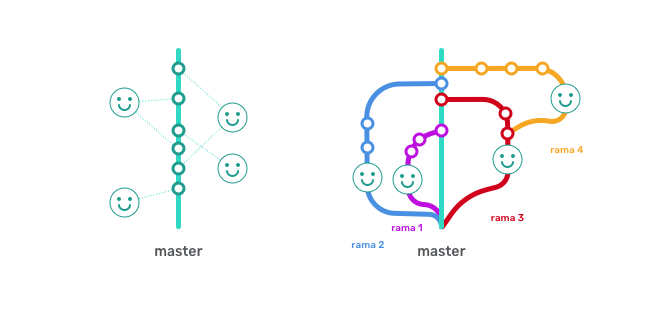
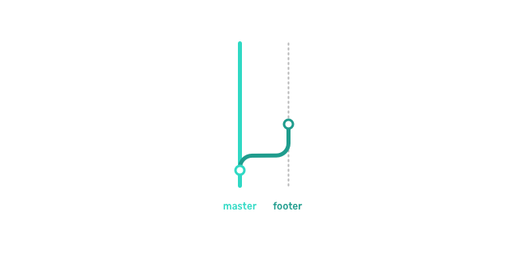
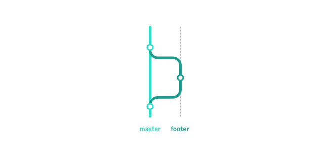
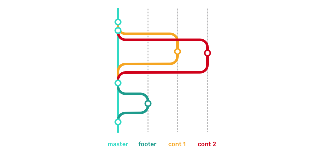
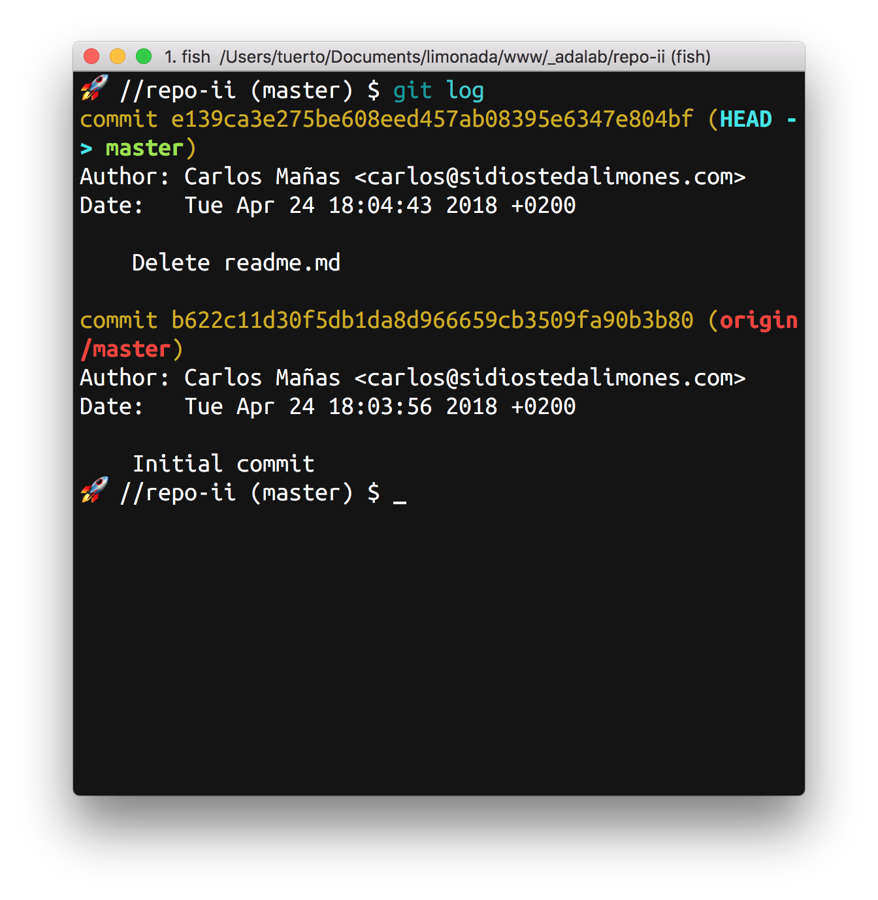
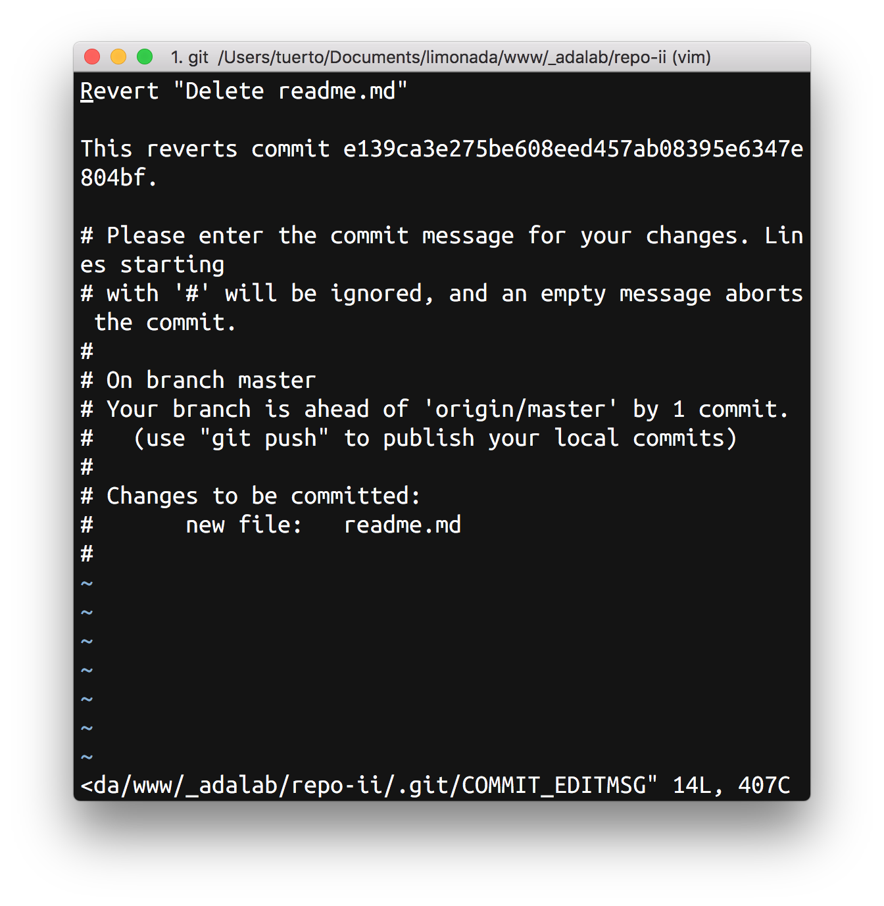
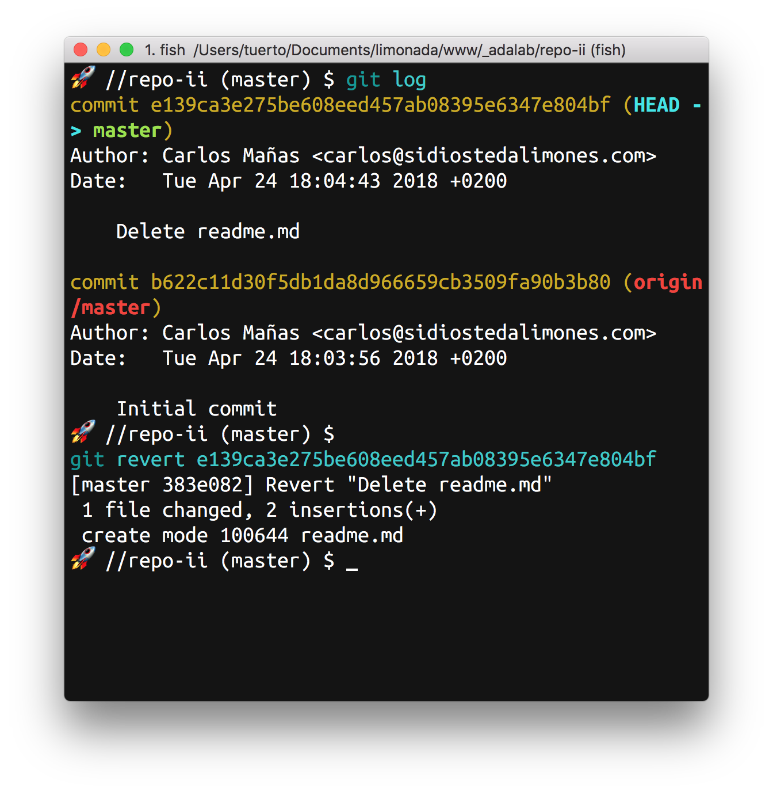
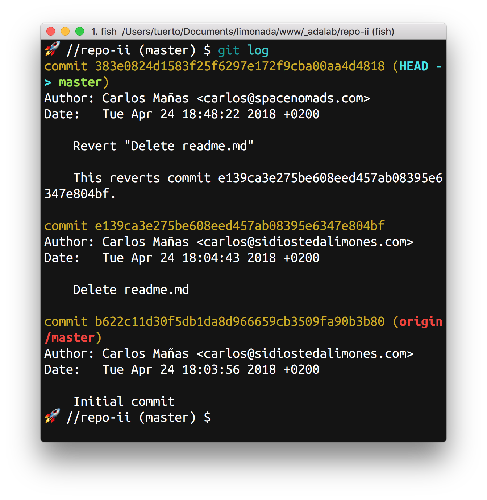

# Control de versiones

## Contenidos

<!-- TOC depthFrom:4 depthTo:6 -->

- [EJERCICIO 1](#ejercicio-1)
- [EJERCICIO 2](#ejercicio-2)
- [EJERCICIO 3](#ejercicio-3)
- [EJERCICIO 4](#ejercicio-4)
- [EJERCICIO 5](#ejercicio-5)
- [EJERCICIO 6](#ejercicio-6)
- [EJERCICIO 7](#ejercicio-7)
- [EJERCICIO 9](#ejercicio-9)

<!-- /TOC -->

## Introducción

Hasta ahora hemos hecho una primera aproximación a Git, nada menor. Sabemos crear un repositorio y subir y bajar cambios a través de:

```bash
git add -A
git commit -m "Message commit"
git push
```

También sabemos cómo publicar nuestro trabajo a través del sistema de hosting de GitHub: **GitHub Pages**.

Hoy vamos a ver cómo mejorar nuestros repos y trabajar en grupo sobre el mismo proyecto y sus archivos.

## Mejorando nuestros repositorios

A continuación vamos a aprender 3 ficheros que usamos en los repositorios para gestionarlos mejor y añadir información útil para las personas que vean nuestros repos.

### README.md

El archivo `README.md` es un documento escrito en [markdown](https://es.wikipedia.org/wiki/Markdown) que se presenta en la página principal del repositorio y tiene como objeto aportar una primera documentación o presentación del proyecto.

Markdown es un lenguaje de marcado como HTML pero más simple. Al ser más simple y permitirnos menos opciones, nos resulta más fácil de aprender y además todos los proyectos que hay en GitHub tiene un formato común.

Ejemplos de readme.md:

- [React](https://github.com/facebook/react)
- [Editor de código VS Code](https://github.com/Microsoft/vscode)
- [Gulp (Automatizador de tareas)](https://github.com/gulpjs/gulp)

Os recomendamos que cuando tengáis tiempo le pongáis un buen README.md a todos vuestros repositorios. Las empresas que están buscando Adalabers lo agradecerán.

### .gitignore

Git tiene un sistema para poder ignorar archivos de un repositorio.
**¿Y por qué querríamos hacer esto?** Porque **hay archivos** que necesitemos en nuestra carpeta de trabajo local pero **que no queremos subir al repositorio ni controlar sus cambios**.

En proyectos pequeños como los que tenemos ahora vamos a querer siempre subir al repositorio remoto todos nuestros archivos. Pero pronto pasará que tendremos una carpeta con los archivos de diseño de ciertas partes del proyecto o archivos comprimidos que usamos para enviar a nuestro cliente los avances.

> **Nota:**	Es muy común que el propio sistema operativo cree en cada carpeta una serie de archivos o carpetas ocultas que le ayudan a realizar tareas como la búsqueda de archivos. Estos archivos del sistema operativo no queremos subirlos al repositorio remoto.

Estos archivos, que no tiene sentido tener "controlados" pero que en nuestra repo local queremos mantener, se listan en este archivo especial, `.gitignore` para decirle al algoritmo de Git que no los tenga en cuenta.

En [gitignore.io](https://www.gitignore.io) podemos encontrar una serie de configuraciones ya hechas que nos ayudan a ignorar tipos de archivos comunes según el sistema operativo o el lenguaje en el que trabajemos.

### Licencia

Uno de los puntos claves en un entorno social donde poner al alcance de todos tus proyectos, es indicar cómo y en qué términos se deben usar. Para esto están las licencias, que son archivos legales que especifican qué se puede y qué no se puede hacer con los archivos asociados.

GitHub nos ofrece un enlace donde nos intenta orientar sobre qué licencia elegir en cada caso: [choosealicense.com](https://choosealicense.com).

## Compartir código con mi equipo

Otras de las bondades de Git es que hace que trabajar en grupo sea **seguro y más fácil**. Nos evita por ejemplo: tener que compartir archivos a través del email, perder código cuando una compañera lo sobreescribe por error...

Las primeras semanas de utilizar Git **nos equivocamos de vez en cuando** y creemos que hemos perdido un montón de código que nos ha costado la vida crear. Y lo que es peor, a veces nos pasa eso con el código de nuestras compañeras. Pues gracias a Git **todo lo que esté dentro de un commit no se pierde nunca**. Git nos permite viajar al pasado, recuperar el código y volver al presente.

El primer paso es permitir a nuestras compañeras modificar nuestro repo. Desde el GitHub de nuestro repositorio accedemos a **Settings** y desde allí a **Manage access** donde podremos añadir a nuestras colaboradoras favoritas, o a las que nos toquen ;)

### Modificar archivos en local y subir a remoto los cambios

Ya lo hemos ido viendo estos días:

1. Se modifican archivos y **se guardan los cambios en el editor**.
1. **Se añaden para su control** con `git add -A` (añade todos los archivos modificados) o con `git add nombre-de-archivo` (añade solo el archivo especificado).
1. **Creamos el commit** con `git commit -m "Short description of the commit"`

Hasta aquí todo normal. Ahora llega el momento de **subir el commit** (o los commits, si hemos hecho varios) con nuestros cambios al repositorio remoto con `git push origin master`, pero pueden pasar varias cosas:

1. Que se suba bien, **sin problemas ni conflictos**. Yay!
1. Que no podamos subir nuestros cambios porque **no estemos trabajando con la última versión**. Lo sabremos porque la terminal nos muestra un error. En este caso tendremos que hacer `git pull` para actualizar nuestro repositorio local con la última versión que se encuentra en remoto, es decir, **nos traemos los últimos cambios** hechos por otras personas a nuestro ordenador.

> **Nota:** Antes de comenzar a trabajar, de vez en cuando y antes de hacer un commit **es una buena práctica hacer `git pull`** y actualizar nuestro repositorio local con los cambios que otras personas han subido al repositorio remoto. Aun así, ocurrirá que tras hacer nuestros cambios y commitearlos, al intentar hacer `git push` el terminal nos indique que tenemos que hacer `git pull` primero, esto ocurre por que alguna compañera ha subido cambios mientras nosotras trabajábamos.

### ¿Qué pasa cuando hacemos un `git pull`?

Pasan varias cosas:

1. Git comprueba si en el repositorio remoto hay una versión posterior (más nueva) a la que se encuentra en nuestro repositorio local.
1. Si encuentra cambios posteriores, se los baja e intenta mezclarlos con los de nuestros commits.

Y aquí tenemos dos escenarios diferentes:

1. Los cambios que se han bajado de remoto (realizados por mis compañeras) y los míos se pueden mezclar (o mergear) automaticamente, Git crea un commit automático con esta mezcla (o merge) y nos lo muestra usando el editor por defecto que tenemos configurado en nuestra terminal (NANO, vim...). A esto se le llama un **soft merge**.
1. Otra posibilidad es que Git no pueda mezclar los cambios automáticamente. Entonces nos avisa de que hay conflictos que tendremos que resolver nosotras manualmente. Nos mostrará una lista de archivos donde se encuentran los conflictos. Es importante leer toda la info que nos muestra la terminal. A esto se le llama un **hard merge**.

> **Nota:** En el primer caso podremos cambiar el mensaje del commit automático o poner uno nuevo. Guardamos aceptando el nombre que nos propone, salimos, y hacemos un push (se subirá el commit con nuestros cambios y el commit con el merge o mezcla).

### ¿Qué pinta tiene un conflicto?

Un conflicto ocurre cuando git se encuentra con dos versiones del mismo bloque de código. Entonces, marca en el documento que hay un conflicto y muestra las dos opciones para que nosotros elijamos qué hacer:
```
<<<<<<<
1ª versión del código en conflicto
=======
2ª versión del código en conflicto
>>>>>>>
```

`<<<<<<<`: Indica el inicio de la zona de conflicto, en la línea siguiente muestra el primer bloque en conflicto.

`=======`: Separa las dos versiones, seguidamente muestra el bloque alternativo que está dando conflicto.

`>>>>>>>`: Indica el final e la zona de conflicto

Aquí puede pasar que queramos la primera opción, la segunda, las dos, o una mezcla de las dos.

La manera de **afrontar este conflicto** es elegir lo que queremos que ponga en ese bloque, quitar los separadores que añade Git, guardar el archivo y hacer add, commit y push con normalidad.

Los conflictos más pequeños los resolveremos sobre la marcha, en **los más complicados tendremos que hablar con la compañera que haya hecho los cambios para decidir qué hacer**. No queremos machacar el código de una compañera sin su permiso.

[Vídeo](https://www.youtube.com/watch?v=jDOVhbgc8Ec) sobre cómo trabajar dos personas en paralelo en un repositorio y cómo solucionar merges blandos (cuando ambas personas tocan diferentes líneas de código) y merges duros (cuando ambas personas tocan la misma línea):



## Ramas

Cuando subimos los commits habréis visto que escribimos `$ git push origin master`, lo que estamos diciendo es que suba muestra **rama master** al repositorio remoto.

### Madre de CROM, ¿¿qué es una rama???

Git nos permite crear versiones paralelas de nuestro proyecto para poder desarrollar o probar varias funcionalidades a la vez sin miedo a perder lo hecho hasta ahora:



Cuando iniciamos un repositorio git se crea una primera rama, y se llama `master` por convención. En la última sesión trabajamos en esa rama.

Vamos a ver el trabajo en ramas a través de un ejemplo, como un mini proyecto de grupo, porque al fin y al cabo, Git va de trabajar en grupo.

#### EJERCICIO 1

1. Vamos crear un repositorio por pareja, donde ambas debéis tener acceso al repositorio (la que lo crea debe dar acceso al usuario de GitHub de la otra).
1. Crearemos una primera versión de nuestra web (solo en HTML) que tendrá:
	1. Un `<header>` con un `<h1>` con el nombre del grupo
	1. Un `<main>` con dos secciones:
		1. `<section class="motivacion"></section>`
		1. `<section class="contenido"></section>`
	1. Un `<footer>` con un `<p>` con el texto: "Maquetado en grupo en Adalab"
1. Lo subiremos a GitHub

Nos tiene que quedar algo así:

```html
<!DOCTYPE html>
<html lang="en">
<head>
	<meta charset="UTF-8">
	<title>Grupo nombre-de-grupo</title>
</head>
<body>
	<header>
		<h1>Grupo nombre-de-grupo</h1>
	</header>
	<main>
		<section class="motivacion"></section>
		<section class="contenido"></section>
	</main>
	<footer>
		<p>Maquetado en grupo en Adalab</p>
	</footer>
</body>
</html>
```

\_\_\_\_\_\_\_\_\_\_

### Creando ramas

Para crear ramas escribimos y movernos a ella tenemos dos comandos:

```bash
git branch nombre-de-la-rama
git checkout nombre-de-la-rama
```

Tenemos un atajo para crear la rama y cambiarnos a ella directamente:

```
git checkout -b nombre-de-la-rama
```

En cualquier caso, si queremos movernos de una rama a otra usaremos `git checkout nombre-de-la-rama`, de esta manera podemos movernos a nuestra nueva rama o volver a `master` en cualquier momento.

> **Nota:** Para poder movernos entre ramas debemos tener todos los archivos modificados, al menos, añadidos a un futuro commit. Si modifico un archivo y me intento cambiar de rama no me dejará.

Añadir archivos y crear un commit funciona igual pero cuando queramos hacer un push usaremos:
```
git push origin nombre-de-la-rama
```

La primera vez usaremos el git push con `-u`:
```
git push -u origin nombre-de-la-rama
```

#### EJERCICIO 2

1. Una de la pareja creará una rama `footer`, nos movemos a ella y modificamos un poco nuestro proyecto. Añadiremos a nuestro footer el enlace a la web de Adalab, quedando así:
   ```html
   <footer>
   	<p>Maquetado en grupo en <a href="http://adalab.es">Adalab</a></p>
   </footer>
   ```
1. Como siempre, añadimos, commiteamos y hacemos push, esta vez usando `git push -u origin footer`.
1. Si ahora cambiamos a la rama `master` veremos que permanece como la dejamos y que el cambio del enlace solo está hecho en nuestra rama `footer`.



\_\_\_\_\_\_\_\_\_\_

### Fusionar ramas

Una vez que hemos terminado el trabajo en nuestra nueva rama y lo hemos subido al servidor remoto queremos aplicar estos cambios en nuestra rama principal, `master`.

Para ello nos vamos a la rama destino (en este caso `master`) con `git checkout master`,  y escribiremos:

```
git merge nombre-de-la-rama
```

Esto nos mezclará nuestra versión local de la rama `nombre-de-la-rama` con la rama donde estemos, en este caso, `master`. Si todo va bien nos mezclará las ramas, creará un commit automático y si hacemos un `git status` nos dirá que solo queda hacer un `git push origin master` y ya.

> **Nota:**	Es importante haber hecho un `git pull` en la rama que vamos a fusionar, en este caso `nombre-de-la-rama` antes de empezar el proceso de fusión para asegurarnos de que tenemos la última versión en ambas ramas.

#### EJERCICIO 3

Vamos a fusionar nuestra rama `footer` con `master` para que nuestra web tenga el enlace que hemos añadido anteriormente.
Para ello:

1. Nos movemos a la rama `footer`.
2. Comprobamos que está correcto y tenemos la última versión.
3. Nos movemos a la rama `master` (sí, es super buena idea asegurarnos de que también tenemos la última versión).
4. Hacernos un merge de la rama `footer`.
5. Resolvemos los conflictos si los hay.
6. Comprobamos que los cambios está hechos.
7. Y subimos al repositorio remoto.

```html
<footer>
	<p>Maquetado en grupo en <a href="http://adalab.es">Adalab</a></p>
</footer>
```



\_\_\_\_\_\_\_\_\_\_

#### EJERCICIO 4

Ahora que hemos hecho un primer acercamiento a las ramas, vamos a hacer lo mismo pero cada miembro de la pareja por separado. Cada una estará encargada de un trabajo diferente que tendrá que realizar en una rama y posteriormente mezclar en la rama principal.



Como refleja la imagen vamos a hacer dos ampliaciones de contenido:

1. una alumna de cada pareja tiene que añadir el contenido de la sección con una frase motivadora
1. la otra alumna de la pareja tiene que añadir el contenido de la sección con un título y un pequeño párrafo

**Sección con frase motivadora**
```html
<section class="motivacion">
	<h2>Frase súper motivadora, ¡a tope!</h2>
</section>
```

**Sección con frase y título**
```html
<section class="contenido">
	<h2>Contenido normal</h2>
	<p>Lorem ipsum dolor sit amet, consectetur adipisicing elit, sed do eiusmod tempor incididunt ut labore et dolore magna aliqua.</p>
</section>
```

> **Nota:** Elegid bien el nombre de las nuevas ramas ;)

Ahora realmente da igual el orden, la que acabe su trabajo, que suba su rama al repositorio remoto, y siga los pasos para fusionarlo con master. **¡A por ello!**

\_\_\_\_\_\_\_\_\_\_

[Vídeo](https://www.youtube.com/watch?v=MnaRLneoiSo) sobre cómo trabajar con varias ramas, movernos entre ramas, publicarlas y mergear una rama en otra:



[Vídeo](https://www.youtube.com/watch?v=t-GbqNDrJ4A) sobre qué ramas debemos usar y cómo y cuándo debemos mover el código entre las diferentes ramas para mantener la mejor calidad de código:



## ¡Oh, dios mío! ¡¡He hecho un commit que no quería hacer!!
¿Qué pasa si hago un cambio, lo añado, hago commit y luego... querría no haberlo hecho? Pues no pasa nada, para eso trabajamos con un control de versiones.

Esto pasará de vez en cuando, unas veces por inexperiencia, otras por descuido y otras por otras razones, pero **no hay miedo** porque cada commit queda registrado y siempre podemos volver a consultar uno anterior o revertir el último. Vamos a ver cómo.

Si queremos ver nuestra actividad en el proyecto usamos el comando `git log`, esto nos muestra un listado de los commits realizados.



En este caso, con el último commit, hemos borrado el archivo `readme.md` y ahora vemos que ha sido un error...

Nos gustaría deshacer el commit con el número (o hash): `e139ca3e275be608eed457ab08395e6347e804bf`, para ello usaremos `git revert`:

```
$ git revert e139ca3e275be608eed457ab08395e6347e804bf
```



y si aceptamos el revert, ya lo tenemos:



Si ahora hacemos un `git log` podemos ver cómo queda el historial de commits:



## Issues

Github, como otros servicios de control de versiones, tiene un sistema de tickets, los issues. Te permiten crear pequeñas tareas donde solicitas información, avisar de un problema o de alguna mejora. Además, nos permiten asignar responsables, clasificarlas por etiquetas... Es un sistema similar a las tarjetas de Trello.

#### EJERCICIO 5

**Crear repositorio en GitHub**

Hay que crear un repositorio vacío en GitHub:
- ¿Qué licencia hemos elegido?
- ¿Por qué es importante añadir un README.md?

\_\_\_\_\_\_\_\_\_\_

#### EJERCICIO 6

**Clonar repositorio**

Clonaremos el repositorio de nuestra compañera y le pondremos o abriremos un issue a través de la web de GitHub para que nos añada como colaboradora con permisos de escritura.

\_\_\_\_\_\_\_\_\_\_

#### EJERCICIO 7

**Eliminar un repositorio**

No es tan habitual pero de tanto en tanto querremos hacer limpieza en nuestra cuenta de GitHub. ¿Seremos capaces de borrar el repositorio que acabamos de crear? ¿Sí, no? :)

\_\_\_\_\_\_\_\_\_\_

#### EJERCICIO 9

**Solucionar un conflicto**

Una vez que tenemos las dos el repositorio en nuestro equipo vamos a modificar index.html a la vez. Cada miembro del equipo hará un cambio, su commit y lo subirá. El conflicto lo resolveréis entre las dos :)

\_\_\_\_\_\_\_\_\_\_

## BONUS: Paquete de Code para Git

Code trae por defecto un paquete para integración con Git y GitHub que nos ayuda con las tareas de control de versiones de nuestro día a día.

En el explorador (menú de la izquierda), aparecen:

- Con color verde los ficheros nuevos respecto al último commit local.
- Con color amarillo los ficheros modificados desde el último commit local.

También en el panel principal, el editor del fichero que estamos editando, aparece a la izquierda del número de línea una franja de color:

- Amarillo para las líneas modificadas desde el último commit.
- Verde las líneas nuevas desde el último commit.

Este paquete también facilita una herramienta gráfica para resolver conflictos, que ayuda a elegir la versión del código que nos interesa mantener.

Además nos permite ver qué se ha modificado en nuestro proyecto solo haciendo click en el icono lateral: 

Podéis leer más sobre las posibilidades de [VS Code y Git](https://code.visualstudio.com/docs/introvideos/versioncontrol).
