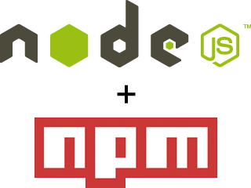

# Automatización de tareas

## Contenidos

- [EJERCICIO 1](#ejercicio-1)
- [EJERCICIO 2](#ejercicio-2)
- [EJERCICIO 3](#ejercicio-3)
- [EJERCICIO 4](#ejercicio-4)

## Introducción

En esta sesión usaremos herramientas para automatización de tareas en nuestro flujo de trabajo en front-end. Estas herramientas son muy útiles porque nos ayudan a ser más eficientes en nuestro trabajo y nos ahorran tareas repetitivas y nos impiden equivocarnos.

> **Nota:** Antes de comenzar a trabajar en esta lección debes haber realizado la [Guía de instalación de Node JS](../instalacion/instalacion_de_node_js.md).

## ¿En qué casos se utiliza?

En nuestro flujo de trabajo realizamos algunas tareas repetitivas. Por ejemplo, convertir el Sass en CSS. Sass es una tecnología que veremos en la próxima sesión y escribimos el código en un lenguaje que luego se convierte en CSS.

Otra tarea habitual que se suele hacer es optimizar los ficheros CSS y JavaScript antes de subir la web al servidor o servidor de producción (a GitHub Pages en nuestro caso). Esta optimización se realiza para que el navegador pueda cargar y ejecutar los archivos más rápido y mostrar la página con más rapidez.

Con una herramienta como Gulp, vamos a poder hacer que nuestro código Sass se convierta en CSS al guardar el fichero; y ejecutar una tarea para que nos guarde el CSS / JS con código optimizado que más tarde subiremos a nuestro servidor (de nuevo, GitHub Pages en nuestro caso).

## Node JS y NPM



[Node JS](https://nodejs.org/es/) es un sistema para ejecutar **JavaScript en la terminal**, lo que nos permite crear un servidor web programado en JavaScript. Esto quiere decir que cuando termines el curso de Adalab ya sabrás programar en JavaScript y podrás empezar a hacer tus pinitos en un **lenguaje de back**.

[NPM](https://www.npmjs.com/) es un **gestor de paquetes y dependencias**. Pocas veces programamos el 100% del código de nuestra página web. Siempre usamos paquetes de código desarrollados por terceras personas.

En el siguiente [vídeo](https://www.youtube.com/watch?v=6TdLfVEzvhk) vemos una pequeña introducción a estas dos herramientas. No es momento de aprenderlas a fondo, solo queremos que entendáis a alto nivel qué son y cómo funcionan:



Los comandos usados en el vídeo son:

```shell
npm install
```

```shell
npm start
```

## Gulp


**[Gulp](https://gulpjs.com/) es una herramienta de automatización de tareas** que está programada con JavaScript y Node JS. A su vez la usamos como dependencia a través de NPM. Gulp no tiene interfaz gráfica sino que se ejecuta desde la terminal de comandos, al igual que sucede con Git.

Decir que Gulp lo usaremos a través del terminal, que no tiene interfaz gráfica y que la configuración te la tienes que hacer tú mismo hace que sea difícil de vender como algo mejor. Pero la clave de Gulp reside en esa última característica, la de configurarlo a través de JavaScript. **La potencia de usar una herramienta de automatización de tareas como Gulp es que podemos configurarla a nuestra manera** y añadir procesos y tareas a medida que las necesitemos e ir mejorando poco a poco estos para adaptarlos a nuestras necesidades. Esto es el motivo principal por el que en la mayoría de las empresas tienen automatizadas las tareas con herramientas como Gulp.

En el siguiente [vídeo](https://www.youtube.com/watch?v=zJC-d45Rvks) vemos una pequeña introducción a Gulp. Al igual que con el vídeo anterior no es momento de aprenderlas a fondo, pero sí es necesario saber para qué es y cómo funciona. Sabiendo esto es fácil que vosotras poco a poco vayáis **aprendiendo cosas sobre Gulp a vuestro ritmo**:



El comando usado en el vídeo es:

```shell
npm -g install gulp-cli
```

> **Nota:** La opción `-g` indica que el módulo `gulp-cli` se va a instalar globalmente, es decir, que es accesible desde cualquier carpeta del ordenador.

Y ahora que ya sabemos cómo funcionan Node JS, NPM y Gulp, vamos a trabajar con un proyecto que os hemos preparado que usa estas tres herramientas... y alguna más.

## Adalab web starter kit

Hemos preparado **una base de código** para hacer proyectos o ejercicios durante el curso.
Usa Gulp para ejecutar una serie de tareas (procesar los scss, gestionar las imágenes, los JS...) y vamos a tener una estructura un poco diferente, más adaptada a un proyecto real.

Tendremos tres carpetas (por defecto solo viene una en el kit):

- **`src/`**: donde tenemos nuestros archivos de trabajo: html, scss, js e imágenes.
- **`public/`**: nosotras trabajaremos sobre los archivos de trabajo de la carpeta `src/` y **Gulp se encarga de pasarlos correctamente a esta carpeta**. El servidor web local se ejecutará aquí.
- **`docs/`**: esta es opcional y es donde se genera una versión de producción de nuestro proyecto para que la subamos a GitHub Pages.

En este [vídeo](https://www.youtube.com/watch?v=XwvhXvBijos) os contamos cómo trabajar en un proyecto con Adalab web starter kit. Este vídeo no es una intrdocción... es una chapa de las buenas, pero es bueno entender a fondo cómo funciona el proyecto:



Y en este otro [vídeo](https://www.youtube.com/watch?v=qqGClcgt9Uc) explicamos cómo migrar de un proyecto existente a un proyecto con el Starter kit, y cómo prepararlo para el servidor de producción que en nuestro caso es GitHub Pages:



### Tarea `npm start` o `gulp`

La tarea por defecto lanza un servidor web con **BrowserSync** y varios watchers estarán pendientes de los archivos SCSS, JS, HTML... para recargar el navegador cuando se necesite.

Además, **aplica automáticamente autoprefixer a nuestros estilos**, es decir, que añade todos los **vendor prefixes** adecuados `moz-`, `webkit-`, etc. También agrupa todas la mediaqueries que hayamos creado en los SCSS y las coloca al final del documento CSS, de esta manera podemos escribir mediaqueries donde las necesitemos y ya Gulp se ocupará de agruparlas y colocarlas en su sitio.

### Tarea `npm run docs` o `gulp docs`

Esta tarea se ejecuta una sola vez y no lanza servidores web ni watchers, pero genera una versión lista para producción (para subirla a un servidor, activar GitHub Pages o enviar a nuestra clienta) en la carpeta **`docs/`**.

Normalmente a esta tarea también se le llama **deploy**, ya que lo que hace es **desplegar** el código en un servidor.

#### EJERCICIO 1

Vamos a empezar a trabajar con el Web starter kit:

1. [Descarga Adalab web starter kit](https://github.com/Adalab/adalab-web-starter-kit).
1. Observa las carpetas y ficheros que hay en él.
1. Ejecuta `npm install`. ¿Qué carpeta se ha creado?
1. Ejecuta `npm start`. ¿Qué carpeta se ha creado?
1. Podrías explicar a tu compañera qué hace cada una de las tareas de Gulp que aparecen en consola.
1. Ejecuta `npm run docs`. ¿Qué carpeta se ha creado?
1. Abre los dos ficheros `main.css` y observa las diferencias. ¿Sabrías decir por qué?

\_\_\_\_\_\_\_\_\_\_

### Migración de proyectos colaborativos

Como hemos visto en los vídeos la estructura de ficheros y carpetas del repo después de la migración no se parece en nada a la que había antes de la migración.

**Imaginemos por un momento** que tenéis que migrar el proyecto de equipo al Starter kit y que cada compañera está trabajando con unos ficheros diferentes **en una rama diferente...** Si una compañera migra el proyecto y el resto de compañeras siguen trabajando en ramas que no tienen la nueva estructura de ficheros y carpetas... **¿qué pasará cuando las compañeras hagan un merge de sus ramas a master?**

#### EJERCICIO 2

Entre tu compañera de pair y tú buscad una solución a este problema. No hace falta que programéis nada, **simplemente iniciad un apasionado debate a nivel conceptual y filosófico sobre las diferentes opciones para prepararse antes de una migración de código**.

\_\_\_\_\_\_\_\_\_\_

### Motor de plantillas

Un motor de plantillas o de templating es un sistema que nos facilita la vida a la hora de trabajar con ficheros HTML. Nos permite dividir un fichero HTML en partes pequeñas a las que llamamos **partials**, y reutilizar estos partials en muchos sitios.

Por otro lado también nos permite separar la estructura HTML, es decir las etiquetas, del contenido de la página, es decir el texto y las imágenes.

Vamos a ver el último [vídeo](https://www.youtube.com/watch?v=4GwXOJ045Zg) (de hoy), para saber cómo utilizar un motor de plantillas:



Cómo hemos visto, **un motor de plantillas es en esencia una herramienta que combina y reemplaza código**. Que ese código esté bien o mal, es cosa nuestra.

#### EJERCICIO 3

En tu vida como programadora a menudo migrarás proyectos, desde una versión vieja a una más moderna, o de una tecnología a otra. **Hoy vas a hacer tu primera migración.** Ponte calzado cómodo:

1. Abre tu repositorio de la evaluación intermedia.
1. Crea una rama nueva llamada `migration` y entra en ella.
1. Descarga otra vez el Starter kit.
1. Usa los ficheros del Starter kit dentro de tu nueva rama para migrarlo.
1. Pushealo a la rama.

> **Nota:** No mergees la rama `migration` a la rama `master` hasta que los profes hayamos terminado de corregir tu evaluación.

\_\_\_\_\_\_\_\_\_\_

#### EJERCICIO 4

Hoy a venido la desarrolladora DevOps de la empresa y nos pide que la carpeta de imágenes se tiene que llamar `img/` porque así está en el resto de proyectos de la empresa, y le simplifica la gestión de los servidores. Para ello, partiendo del ejercicio anterior:

1. Arranca el proyecto con `npm start` y busca la carpeta `images/` dentro de la carpeta `public/`. Observa dónde se ha creado.
1. Para `npm start` con `ctrl+c` y borra la carpeta `public/`.
1. Edita el fichero `config.json` > `images` > `dest` cambiando `public/assets/images/` por `public/assets/img/`.
1. Vuelve a arrancar el proyecto y busca en qué carpeta se han creado ahora las imágenes.
1. Como siempre, después de cualquier cambio tenemos que comprobar que no se ha roto nada. Mira la página en el navegador y verás que las imágenes han desaparecido :( OMG!! pues tenemos que arreglarlo.
1. Abre el Devtools de Chrome, entra en la pestaña de Console y mira el mensaje de error que aparece. ¿Qué nos está diciendo?
1. Arregla este error sin modificar el fichero `config.json`.

\_\_\_\_\_\_\_\_\_\_

## Recursos externos

- [Gulp for beginners](https://css-tricks.com/Gulp-for-beginners/)
- [Ejemplo de iniciación de Gulp](https://github.com/luisddm/Gulp-adalab) creado por un voluntario para Adalab.
- [Plugin de Gulp para trabajar con imágenes](https://www.npmjs.com/package/gulp-imagemin)
- [Plugin de JSLint](http://www.jslint.com/)
- [Plugin de CSSLint](http://csslint.net/)

> **Nota:** Un **linter** es un programa que detecta errores de uso y/o estilo en un código
