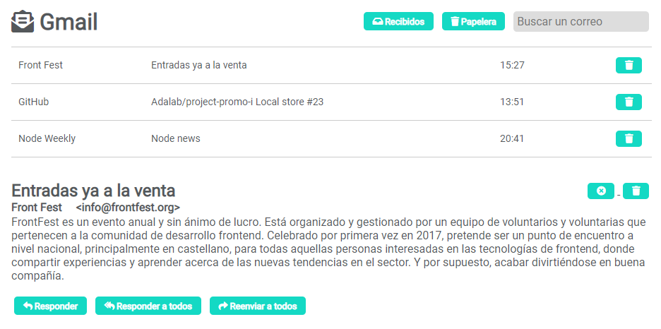

## GMail

En las lecciones de estos materiales solemos trabajar sobre ejercicios pequeños y aislados con los que practicamos los conocimientos aprendidos en un día.

Hemos querido prepararos un ejercicio global y completo que relaciona todos los conceptos aprendidos durante todo el módulo 3 de React.

Este ejercicio se grabó con público en directo en clase, durante el **módulo 3 de la Promo Idelisa**. Y es una especie de gestor de correos parecido a GMail:

### Capítulos

- Este ejercicio está compuesto de una carpeta **00** donde está el enunciado del ejercicio y 9 capítulos que están en las carpetas **01 a la 09**.
- Las carpetas **01 a la 09** se corresponden con cada uno de las lecciones del curso.
- El código fuente HTML, JS, React y CSS de cada capítulo está en su respectiva carpeta en el [repositorio de ejercicios extra > react gmail](https://github.com/Adalab/ejercicios-extra/tree/master/react-gmail).
- El código fuente que hay en estas carpetas es código que hay al final de cada capítulo.

## T1E1: intro y props

### [Arrancar y limpiar el proyecto](https://www.youtube.com/watch?v=3shSbykv0hA)



### [Añadir html y css](https://www.youtube.com/watch?v=jEdWBJOBDhI)



### [Crear componentes](https://www.youtube.com/watch?v=sm8OFxPaGGM)



### [Pasar datos de madres a hijas por props](https://www.youtube.com/watch?v=3shSbykv0hA)



## T1E2: pintar un listado

### [En capítulos anteriores](https://www.youtube.com/watch?v=eP4bcAIOlbA)



### [Pintar un listado](https://www.youtube.com/watch?v=EOiVXgnOpxU)



### [Mover datos a un fichero externo](https://www.youtube.com/watch?v=fiAflHGZvDk)



## T1E3: eventos

### [Escuchar evento en un componente de clase](https://www.youtube.com/watch?v=FN69XR0F3O4)



### [Escuchar evento en un componente funcional](https://www.youtube.com/watch?v=wWObXeJTsqA)



### [Lifting](https://www.youtube.com/watch?v=KKyfl3BkCkk)



## T1E4: estado

### [Iniciar el estado](https://www.youtube.com/watch?v=a-5JeiXyQHY)



### [Cambio de estado](https://www.youtube.com/watch?v=NCUzSUrqevk)



### [Qué datos guardamos en el estado](https://www.youtube.com/watch?v=hHQMemeGoFk)



## T1E5: más estado

### [Pintar emails](https://www.youtube.com/watch?v=kqng_4UDQOs)



### [Pintar filtros](https://www.youtube.com/watch?v=ehPFygsdg0s)



### [Borrar emails](https://www.youtube.com/watch?v=ERxG6iaWrZY)



### [Mostrar email seleccionado](https://www.youtube.com/watch?v=ZOc9oDaHfAQ)



### [Marcar como leído un email](https://www.youtube.com/watch?v=UaWWEGGVX44)



## T1E6: hooks / useState

### [Qué es un hook](https://www.youtube.com/watch?v=9K-k6ezBne8)



### [Cambiar componente de clase a funcional](https://www.youtube.com/watch?v=X6wKLPxKCHY)



### [Hook: useState](https://www.youtube.com/watch?v=Fen7YwAETjM)



## T1E7: Formularios en React

### [Componentes controlados](https://www.youtube.com/watch?v=mQfhciPXx_o)



### [Controlar componente con mucha clase](https://www.youtube.com/watch?v=QedVNI3v1OA)



## T1E8: React Router

### [Qué vamos a ver hoy](https://www.youtube.com/watch?v=f-kVm47Yfwc)



### [Qué es una spa router y react router](https://www.youtube.com/watch?v=7E60JC2L3N8)



### [Navegar entre dos páginas](https://www.youtube.com/watch?v=XFWZenA3FQM)



### [Navegar a páginas con parámetros](https://www.youtube.com/watch?v=LElu-LG09Wk)



### [Refrescar páginas con parámetros](https://www.youtube.com/watch?v=axmqQLCcItk)



### [Limpiar un poquito](https://www.youtube.com/watch?v=QqOirBIdI5Y)



### [React router en componente de clase](https://www.youtube.com/watch?v=ceFWcmUkiFA)



### [React router propiedad children](https://www.youtube.com/watch?v=J34gzOJ8Mp0)



## T1E9: Ciclo de vida de los componentes

### [Fetch en componente funcional](https://www.youtube.com/watch?v=U_vATXA7A-I)



### [Fetch en componente de clase](https://www.youtube.com/watch?v=13CjXL1lsXc)



### [Local storage en componente funcional](https://www.youtube.com/watch?v=_qY3N2nLkK0)



### [Local storage en componente de clase](https://www.youtube.com/watch?v=qyUO0-rWSFs)



## T1E10: Dar cera, pulir cera

### [Limpiar archivos](https://www.youtube.com/watch?v=-5XhLwRwCpk)



### [Limpiar servicios](https://www.youtube.com/watch?v=Rc_hrJevIhg)



### [Limpiar componente funcional](https://www.youtube.com/watch?v=jV9e4cMNLx4)



### [Limpiar componente de clase](https://www.youtube.com/watch?v=yxMIM1fFfd8)



### [Limpiar el resto de componentes](https://www.youtube.com/watch?v=h34O2OWhwwk)



### [Limpiar funcionalidad](https://www.youtube.com/watch?v=IuwRN8rvf7M)



### [Añadir loading](https://www.youtube.com/watch?v=xQ_LYPSbWXY)

